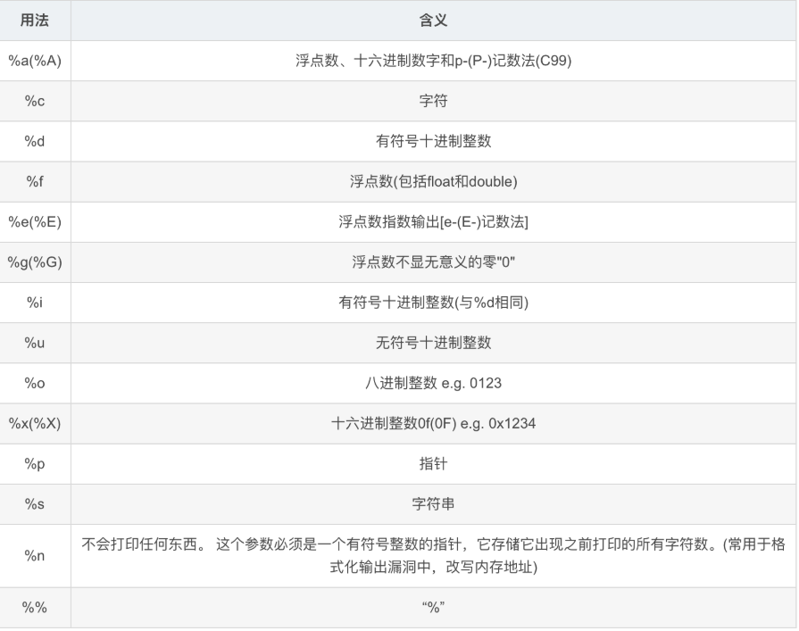
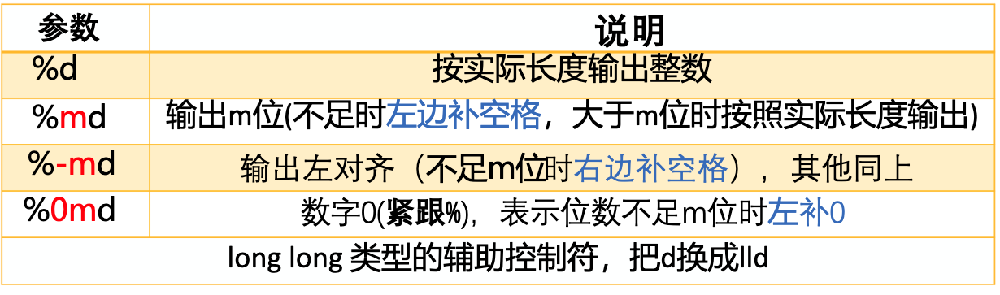
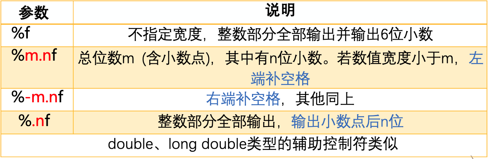
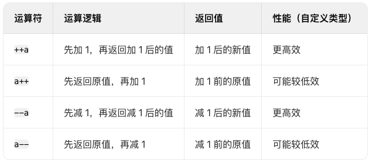
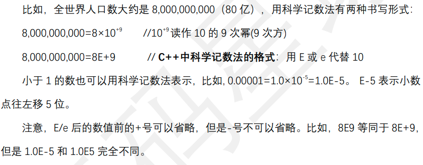
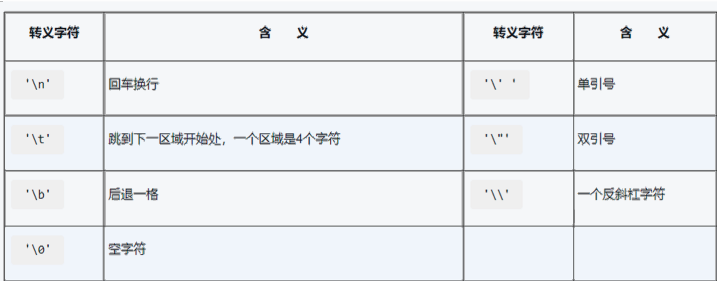
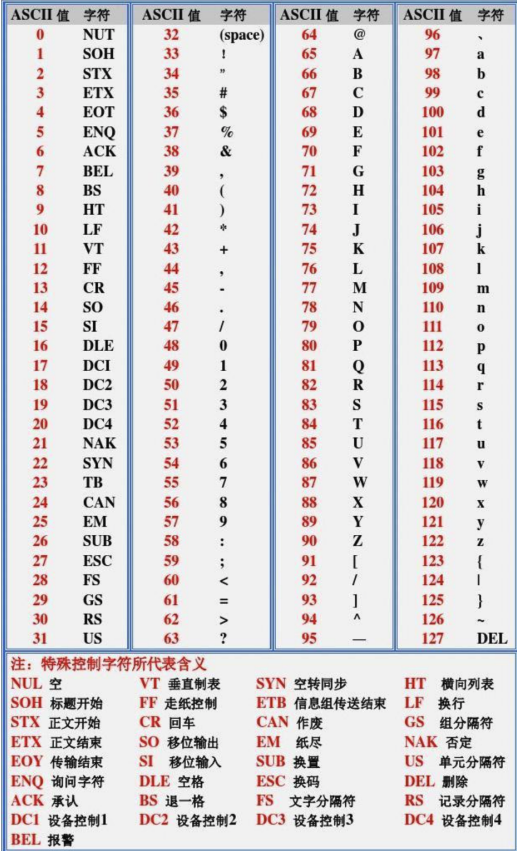
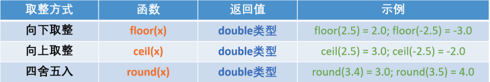
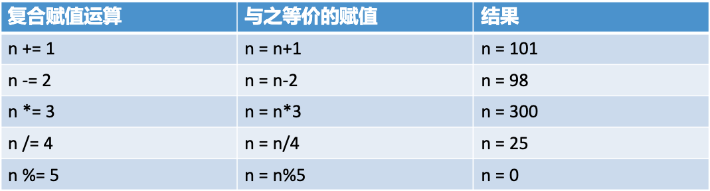
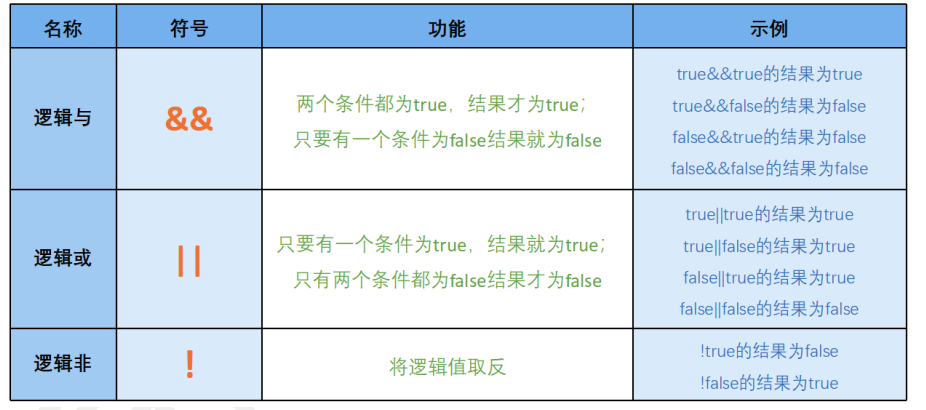

## 一、基础语法

### 1.1 程序结构

```c
#include <iostream>  // 头文件包含
using namespace std; // 命名空间
int main() {         // 主函数
    cout << "Hello World!" << endl; // 输出语句
    return 0;        // 返回值
}
```

### 1.2 变量与常量
1) `常量`是指在程序运行中值不能改变的量。
2) 常量的`命名规则遵循变量的命名规则`。
3) 但是为了容易与变量区别开，推荐用大写字母和下划线命名常量。
4) `常量的声明和赋值必须同时完成`。
5) 声明常量语句用`关键字 const` 开头。
6) `常量的值一经赋值后不能再被改变。`
```C
int a = 10;                // 整型变量
const double PI = 3.14159;  // 常量
auto x = 3.14;             // 自动类型推断
```

### 1.3 基本数据类型

- 字节（Byte）是计算机存储数据的最小单元
- 占字节数越多的数据类型，容量越大（能存储的数值范围越大）

| 类型        | 说明                 | 示例                                         | 数值范围 
| ----------- | -------------------- | -------------------------------------------- |-------------------------------------------- |
| char        | 字符 1 字节 （8 位）         | char grade = 'A';                            | 0 -225
| short      | 短整型 2 字节         | short grade = 10;                            | -32768 到 32767
| bool        | 布尔 1 字节          | bool is_valid = true; if (a > 10) 中的条件结果就是一个布尔值 |
| int         | 整型 4 字节          | int age = 25;                                |  -2147483648 到 2147483647 最大值是 20 亿
| long long   | 长整型 8 字节        | int age = 25;                                | -9223372036854775808 到 9223372036854775807 900 亿亿
| float       | 单精度浮点 4 字节    | float price = 9.99f; (7 位有效数字)          |
| double      | 双精度浮点 8 字节    | double pi = 3.1415926; (15 ～ 16 位有效数字) |
| long double | 长双精度浮点 16 字节 |

| void        | 无类型               | void func();                                 |

#### 求数据类型长度-sizeof(变量｜数据类型｜数值)

- 返回数据类型 `占用的字节数`
- sizeof()的优先级比 \*、/、%的优先级高

### 1.4 格式化输入输出
* 不同类型的变量对应的格式控制符不同
* `%表示格式`的起始符号，不可缺少
* 整型数据类型都必须有 `d`
* 浮点型都必须有 `f` -> float `lf` -> double `LF` -> long double
* l、L 是长度修饰符
#### 1. 格式化输出

格式化输出所用的函数为 printf，它可以输出任意位数的小数。

使用格式：printf(“%.nf”,a)。这句话的作用是将变量 a 保留 n 位小数输出。

> 注意事项：
>
> - 这里的 n，需要具体化为一个数字，保留几位小数，如保留两位小数，n 就改成 2，保留三位小数，n 就改成 3;
> - %后面的小数点一定不能漏掉。
> - 使用 printf 的时候，一定要注意加上头文件`#include<cstdio>`


```c
#include <iostream>
#include <cstdio>
using namespace std;
int main() {
  double a = 6.8;
  int b = 5;
  int c = 3;
  // cout<< a*(b+c);
  printf("%.2f", a*(b+c));
  return 0;
}
```
#### 2. 格式化输入函数 scanf()
* 格式：`scanf("格式控制符",变量地址)`。
* 例如，要输入一个整型的变量 a，就可以表示成 `scanf("%d",&a)`。其中，“&”为取地址符，`“&a”`表示取变量 a 的地址。
> 输入多个数据时，如果是整型或浮点型，`必须用分隔符`（空格或回车）隔开；`数值与字符`之间，
> `字符和字符`之间`不要加分隔符`（否则会把分隔符当做需要输入的字符）。
```c
#include <iostream>
using namespace std;
int main() {
  int num;
  float flt;
  char ch;
  scanf("%d%f%c", &num,&flt,&ch);
  cout<< num << " " << flt << " " << ch;
  return 0;
}
// 2 2.5a
// 2 2.5 a
```
#### 3. cout 精度控制
* fixed 配合 setprecision(n) 可以控制 cout 语句中浮点数的输出精度
- 头文件 `<iomanip>`

```c
cout << setprecision(4) << 3.1415926;  // 输出 3.142（四舍五入，4位有效数字）
cout << fixed << setprecision(4) << 3.1415926;  // 输出 3.1416（4位小数）
```
#### 4 填充和对齐
* setw(n)：设置字段宽度为n，不足部分用填充字符填充。
* setfill(c)：设置填充字符为c（默认是空格）。
* left/right/internal：设置左对齐、右对齐或内部对齐（符号左对齐，数值右对齐）。
```c
cout << setw(10) << setfill('*') << left << 123;  // 输出 "123*******"
cout << setw(10) << setfill('*') << right << 123;  // 输出 "*******123"
cout << setw(10) << setfill('*') << internal << -123;  // 输出 "-*******123"
```


```c
#include <iostream>
#include <cstdio>
using namespace std;
int main() {
  int x = 123;
  printf("%5d\n", x);
  printf("%-5d\n", x);
  return 0;
}
//   123
// 123  
```
### 1.5 ++a/a++

* ++a和--a分别是`前置自增运算符`和`前置自减运算符`
1) a++ / a-- 变量在前，先用变量参与其他计算，再进行自增、自减。
2) ++a / --a 变量在后，先进行自增、自减，再用变量参与其他计算。

#### 1. 运算效果
* ++a：将变量a的值加
```c
int a = 5;
++a;  // a 变为 6
```
* --a：将变量a的值减 1
```c
int a = 5;
--a;  // a 变为 4
```
#### 2. 返回值与表达式优先级
* 返回值与表达式优先级
++a：先将a的值加 1，再返回加 1 后的值
```c
int a = 5;
int b = ++a;  // a 先变为 6，然后将 6 赋值给 b
// 最终：a=6, b=6
```
--a：先将a的值减 1，再返回减 1 后的值
```c
int a = 5;
int b = --a;  // a 先变为 4，然后将 4 赋值给 b
// 最终：a=4, b=4
```
#### 3. 与后置运算符的对比
* 前置运算符（++a/--a）先运算再返回值，而后置运算符（a++/a--）先返回原值再运算。
```c
int a = 5;
int b = a++;  // 先将 a 的原值 5 赋值给 b，再将 a 加 1
// 最终：a=6, b=5
```

### 1.6 整数和浮点数的混合运算
* `混合运算`是指`不同数据类型`的运算对象在同一个表达式里参与运算,比如345+0.2*23里有整数也有浮点数。混合运算时会发生`类型转换`
* 表达式中同时有 int 和 float 时，`int 向 float 转换`

### 1.7 科学计数法
* 把一个数表示成 a 与 10 的 n 次幂相乘的形式（1≤|a|<10，a 不为分数形式，n 为整数），这种记数法叫做`科学记数法`



```c 
double  a = 8000000000; //等同于 double a = 8E+9;
float b = 0.00001; // 等同于 float b = 1.0E - 5
```

### 1.8 char 字符
* 字符常量被存储在计算机的存储单元中时，是以其 ASCII 值的形式存储的。
* ASCII 编码的全称是：American Standard Code for Information Interchange （美国
国家标准信息交换代码），对 `128` 个字符进行了编码，`一个字符对应一个 ASCII 编码值`，编
码值的范围是 0~127
```c
const char c = 'a'; //声明字符型常量的语句
char i; //声明字符型变量的语句
char c = 'a';
```
C++中的字符常量有两种：
1) 普通字符: 用单引号标识的一个字符，如'b'、'y'、'?'。
2) 转义字符: 有一些特殊的字符，C++通过单引号内的反斜杠\把后面的字符转成别的
含义。例如，'\n'代表换行，'\r'代表回车，'\''代表单个单引号。



* 常用字符的编码值和位置关系

| 字符 | ASCII值 |
| ----- | -----|
| 空格 | 32|
| 0 | 48|
| 9 | 57|
| A | 65|
| a | 97|
| Z | 90|
| z | 122|

#### 字符输入输出函数 getchar()和 putchar()
* `getchar()`可以从键盘`输入`字符，包括可显示字符和不可显示字符,不过一次只能得到
一个字符；
*` putchar()` 可以把单个字符`输出`到显示器；
* 要使用这两个函数，必须在程序开始部分包含头文件 `<cstdio>`。
```c
#include <iostream>
#include <cstdio>
using namespace std;
int main() {
  char c;
  c= getchar();
  putchar(c);
  return 0;
}
// A
// A
```
```c
#include <iostream>
using namespace std;
int main() {
  char c;
  cout<< "输入一个字符（A～Z）:";
  cin>> c;
  c = (c - 'A' + 3) % 26 + 'A';
  cout<< c;
  return 0;
}
// 输入一个字符（A～Z）: A
// D    
```
```c
#include <iostream>
using namespace std;
int main()
{
  char a, b;
  cin >> a >> b;
  cout << int(a) << " " << int(b) << endl;
  return 0;
}
// A a
// 65 97
```

### 1.9 取整函数
* 要使用这些数学函数，必须在程序头包含 cmath 头文件：`#include<cmath>`
* `floor 向下取整`，它返回的是小于或等于函数参数,并且与之最接近的整数。
* `ceil 向上取整`，它返回的是大于或等于函数参数,并且与之最接近的整数。
* `round 四舍五入`



## 二、运算符与表达式

### 2.1 算术运算符

```c
// 算术运算符
int x = 10 + 5;  // + - * / %

// 关系运算符
bool b1 = (10 > 5);  // > < >= <= == !=

// 逻辑运算符
bool b2 = true && false;  // && || !

// 位运算符
int y = 0b1010 & 0b1100;  // & | ^ ~ << >>


int a = 10, b = 3;
cout << a + b << endl;  // 13
cout << a - b << endl;  // 7
cout << a * b << endl;  // 30
cout << a / b << endl;  // 3 (整数除法)
cout << a % b << endl;  // 1 (取模)
```


### 2.2 关系与逻辑运算符

```c
cout << (a > b) << endl;   // true (1)
cout << (a == b) << endl;  // false (0)
cout << (true && false) << endl; // false
cout << (!true) << endl;   // false
```

## 三、控制结构

### 3.1 条件语句

```c
// if-else
if (score >= 90) {
    grade = 'A';
} else if (score >= 60) {
    grade = 'B';
} else {
    grade = 'C';
}

```
#### switch语句
* switch 语句中“表达式”的`值不能是浮点型值`，必须`是整型、字符型或者布尔型的值`
* 每个常量值对应一个 case，`不能出现重复的常量`
* 当“表达式”的值等于 case 中的常量时，case 后跟的语句将被执行，直到遇到break语句为止。
* 一个 switch 语句可以有一个可选的 default 分支，一般出现在switch 的结尾。default 分支里的语句在上面所有 case 都不为真时被执行。
* `break 可选`。如果当前 case 语句不包含 break，将会继续后续的case，直到遇到break 或“}”为止。
* 执行到 break 时，立即结束（跳出）该 switch 语句，系统将执行switch 语句后面的其他语句。
```c
switch (grade) {
    case 'A':
      bonus = 1000;
    break;
    case 'B':
      bonus = 500;
    break;
    default:
      bonus = 0;
}
```

### 3.2 循环结构 for

```c
for (int i = 0; i < 10; i++) {
    cout << i << " ";
}
```

### 3.3 while 循环
While 循环的执行过程是：
* `先判断循环条件`，如果条件成立，则执行一次循环体
* 执行一次循环体后，再次判断循环条件，如果成立则继续执行一次循环体，然后再看判断条件……
* 如此往复直到判断条件不成立时，退出循环
while 语句的特点：`先判断表达式，后执行循环体语句`。如果表达式的值一开始就为假，则一次循环体也不执行。
```c
int j = 0;
while (j < 10) {
    cout << j++ << " ";
}
```

#### while 循环求和
* 方法一：
```c
#include <iostream>
using namespace std;
int main() {
  int n;
  cin>> n;
  int i = 1, sum = 0;
  while (i<=n){
    sum = sum + i;
    i++;
  }
  cout<< sum;
  return 0;
}
```
* 方法二:
```c
#include <iostream>
using namespace std;
int main() {
  int n;
  cin>> n;
  int i = n, sum = 0;
  while (i>=1){
    sum = sum + i;
    i--;
  }
  cout<< sum;
  return 0;
}
```

#### while找数
编写一个小程序。输入一个数 n，输出 1~n 之间（包含1 和n）所有既能被 3 整除又能被 5 整除的数。
```c
#include <iostream>
using namespace std;
int main() {
  int n;
  cin>> n;
  int i = 1;
  while (i<= n){
    if(i % 3 ==0 && i %5==0){
      cout<< i<<endl;
    }
    i++;
  }
  return 0;
}
```
### 3.4 do-while 循环

先执行，后判断
- `do 是关键字`，用于说明 do-while 循环开始。
- do-while 语句先`执行循环体，再判断循环条件`，即不管循环条件是否为真，至
少会执行一次循环体。

```c
int k = 0;
do {
    cout << k++ << " ";
} while (k < 10);
```
### break / continue
break 语句的作用是强制结束循环体(即使循环还没有执行完)，转向执行循环外的下一
条语句。

而 continue 语句的作用是`强制结束本次循环`，开始下次循环，即跳过循环体中 continue
语句之后的语句，重新判断循环条件。

break 和 continue 都是强制结束循环，所不同的是 `break 是完全终止循环`，而 `continue只终止本次循环，重新判断条件以继续下次循环`。

```c
#include <iostream>
using namespace std;
int main() {
  for (int i = 1; i <= 5; i++){
    if(i % 2 == 0 ) {
      continue;
    }
    cout<< "Hello "<<i<<endl;
  }
  return 0;
}
// Hello 1
// Hello 3
// Hello 5
```
* 编写一个程序，输入两个整数 x，y，找出 1000 以内，既不是 x 的倍数也不是 y 的倍数的最大数。
```c
#include <iostream>
using namespace std;
int main() {
  int x, y;
  cin>> x >> y;
  for (int i = 1000; i >= 1; i--){
    if((i % x != 0) && (i % y != 0 )){
      cout<< i;
      break;
    }
  }
  return 0;
}
```
### 3.5 循环嵌套

- 一个循环体包着另一个完整的循环结构称为循环嵌套。外层循环控制行， 内层循环控制列，
- 外层循环执行一次，内层循环全部执行，然后执行下一次外循环，直到外循环执行完毕，整个流程结束。

* 生成动态三角型
```c
for(int i = 1; i<=20; i++){
  for(int i = 1; i<=20; i++){
    cout<< " * ";
  }
  cout<< endl;
}
```
* 等腰三角形
```c
#include <iostream>
using namespace std;
int main() {
  int n;
  cin>> n;
  for(int i=1; i<=n; i++){
    for(int j=1; j<= n-i; j++){
      cout<< " ";
    }
    for(int j=1; j<= 2*i-1; j++){
      cout<< "*";
    }
    cout<< endl;
  }
  return 0;
}

// 5
//     *
//    ***
//   *****
//  *******
// *********
```
### 3.6 内循环中的 break 语句

内循环 j = 3 时，执行break, 结束内循环，所以内循环只进行了2次循环
```c
#include <iostream>
using namespace std;
int main() {
  for (int i = 1; i <= 4; i++)
  {
    cout<< "外层循环"<< i << endl;
    for (int j = 1; j <= 4; j++){
      if(j == 3){
        break;
      }
      cout<< "   内层循环" << j << endl;
    }
  }
  return 0;
}
// 外层循环1
//    内层循环1
//    内层循环2
// 外层循环2
//    内层循环1
//    内层循环2
// 外层循环3
//    内层循环1
//    内层循环2
// 外层循环4
//    内层循环1
//    内层循环2
```

* 借助标记 `symbol` 跳出多重循环

```c
#include <iostream>
using namespace std;
int main() {
  int symbol = 0;
  for (int i = 1; i <= 4; i++)
  {
    cout<< "外层循环"<< i << endl;
    for (int j = 1; j <= 4; j++){
      if(j == 3){
        symbol = 1;
        break;
      }
      cout<< "   内层循环" << j << endl;
    }
    if(symbol == 1) {
      break;
    }
  }
  return 0;
}
// 外层循环1
//    内层循环1
//    内层循环2
```
### 3.7 continue 与 多重循环
* continue 只影响它所在层的循环，结束本次内循环，继续进行下一次内循环。外循环不受影响

### 3.8 九九乘法表
* 外层循环 i 控制行， 内层循环 j 控制列，输出的值为 i*j
```c
#include <iostream>
#include <iomanip>
using namespace std;
int main()
{
  int i, j;
  for (i = 1; i <= 9; i++)
  {
    for (j = 1; j <= i; j++)
    {
      cout << j << '*' << i << '=' << setw(2) << i * j << " ";
    }
    cout << endl;
  }
  return 0;
}

// 1x1= 1 
// 1x2= 2 2x2= 4 
// 1x3= 3 2x3= 6 3x3= 9 
// 1x4= 4 2x4= 8 3x4=12 4x4=16 
// 1x5= 5 2x5=10 3x5=15 4x5=20 5x5=25 
// 1x6= 6 2x6=12 3x6=18 4x6=24 5x6=30 6x6=36 
// 1x7= 7 2x7=14 3x7=21 4x7=28 5x7=35 6x7=42 7x7=49 
// 1x8= 8 2x8=16 3x8=24 4x8=32 5x8=40 6x8=48 7x8=56 8x8=64 
// 1x9= 9 2x9=18 3x9=27 4x9=36 5x9=45 6x9=54 7x9=63 8x9=72 9x9=81 
```
## 四、一维数组
### 4.1 数组定义
* `数组`是一组`数据类型相同`的数,每个数称为 `数组的元素`
* 声明数组：数据类型、数组名和数组长度
* 数组长度可以用整型常量，或常量表达式指定
* 数组长度不能小于 0 
* 初始值的个数必须>数组长度
* 任何一个数组` 第一个`元素的下标 都为` 0` ，任何一个数组 `最后一个`元素的下标都为`数组的长度 - 1`

定义
```c
// 部分初始化，可以只给数组中的一部分元素赋值， 未赋值的部分元素自动设定为 0
int a[3]={1,2};

// 不指定数组长度初始化。
int a[]={1,2,3}; 
```
```c
int n[5] = {110, 112,113,120,123}; //身高数组
int x;
cin>> x; //老师报数
cout<< n[x-1] // 输出对应位置的学生的身高
```

* 不同类型的数组声明
* 初始值的个数必须 <= 数组长度 （可以少，不能多）`避免数组越界`
```c
int a1 = [5] = {1,2,3,4,5};
float a2 = [10];
char a3 = [20];
```
### 4.2 访问数组的元素
* 用数组名和`下标`来唯一地访问数组中的元素，如 `a[0]`表示访问第一个元素
* 下标代表元素在数组中的序号
* 任何一个数组 `第一个`元素的下标都为 `0`, 任何一个数组的`最后一个`元素的下标都为 `数组长度 - 1`
```c
int a[3] = {1,2,3}
// a[0] = 1
// a[1] = 2
// a[2] = 3
```

### 4.3 循环遍历数组

```c
#include <iostream>
using namespace std;
int main()
{
  int a[5] = {1, 2, 3, 4, 5};
  // 写法一  for 循环从0 到长度，下标：1
  for (int i = 0; i <= 4; i++) {
    cout<< arr[i] << " ";
  }
  // 写法二 for 循环从1 到长度，下标：i-1
    for (int i = 1; i <= 5; i++) {
    cout<< arr[i-1] << " ";
  }
  return 0;
}
```
 * 正序输入，变逆序输出
 ```c
#include <iostream>
using namespace std;
int main()
{
  int a[100] = {0};
  int n = 0;
  cin>> n;
  for (int i = 0; i <=n-1; i++) { // 输入
    cin>> arr[i] << " ";
  }
    for (int i = n-1; i >= 0; i--) { // 输出
    cout<< arr[i] << " ";
  }
  return 0;
}
```
