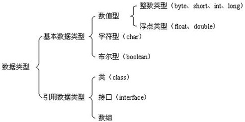
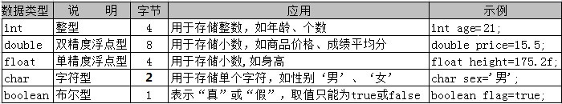

## Java 重要特点
* Java语言是面向对象的（oop）
* Java语言是健壮的，Java的强类型机制、异常处理、垃圾的自动收集等是Java程序健壮性的重要保证
* Java语言是跨平台性的 [即：一个编译好的 .class 文件可以在多个系统下运行]
* Java语言是解释型的， 解释型语言： javascript, PHP, java.  编译型语言： C/C++
> 区别是：解释性语言，编译后的代码，不能直接被机器执行，需要解释器来执行，编译性语言，编译后的代码，可以直接被机器执行，c/c++
## Java的运行机制
* 因为有了 `JVM`(Java 虚拟机),同一个java程序在三个不同的操作系统中都可以执行，这样就实现来java程序的跨平台性
* JVM 负责执行指令，存储数据，内存，寄存器，包含在`JDK中`
## Java中的数据类型
`Java` 语言是一种`强类型`语言。通俗点说就是，在 `Java` 中存储的数据都是有类型的，而且必须在编译时就确定其类型。 




```java
public class Main {
  public static void main(String[] args) {
      String name = "慕课网";
      int age = 18;
      boolean isOk = true;
      char sex = '男';
      double salary = 10000.87;
      System.out.println(name+ isOk+sex);
  }
}
```
##  java中的自动类型转换
```java
public class Main {
  public static void main(String[] args) {
      double avg1 = 78.5;
      int rise = 5;
      double avg2 = avg1 + rise;
      System.out.println("平均分："+avg2);
  }
}
```
> 注意：
1.  目标类型能与源类型兼容，如 double 型兼容 int 型，但是 char 型不能兼容 int 型
```java
int age = 19;
char sex = '男';
char result = age + sex;  // int 类型不能转换成char 类型

```
2.  目标类型大于源类型，如 double 类型长度为 8 字节， int 类型为 4 字节，因此 double 类型的变量里直接可以存放 int 类型的数据，但反过来就不可以了

## Java中的强制类型转换
语法：( 数据类型 ) 数值
```java
      double heightAvg1 = 10.3;
      int heightAvg2 = (int)heightAvg1;
      System.out.println("强制类型转换："+heightAvg2);
```
## Java常量的应用
所谓常量，我们可以理解为是一种特殊的变量，它的值被设定后，在程序运行过程中不允许改变。
常量名一般使用大写字符
语法：final 常量名 = 值;
```java
      final char FINAL_SEX = '男';
      final char FINAL_SEX2 = '女';
      System.out.println("常量："+FINAL_SEX+FINAL_SEX2);
```

## 条件运算符
条件运算符（ ? : ）也称为 “三元运算符”。

语法形式：布尔表达式 ？ 表达式1 ：表达式2

运算过程：如果布尔表达式的值为 true ，则返回 表达式1 的值，否则返回 表达式2 的值
```java
	int score=68;
  String mark =(score>=60)?"及格":"不及格";
  System.out.println("考试成绩如何："+mark);
```
## 循环语句之 while
```java
     int i = 1;
      while (i< 5) {
          System.out.println("循环语句之 while:" +i);
          i++;
      }
```
## 循环语句之 do...while
执行过程：

<1>、 先执行一遍循环操作，然后判断循环条件是否成立

<2>、 如果条件成立，继续执行< 1 > 、< 2 >，直到循环条件不成立为止

特点： 先执行，后判断

由此可见，do...while 语句保证循环至少被执行一次！
```java
    int i2 = 1;
      do {
          System.out.println(" 循环语句之 do...while");
          i2++;
      }while (i2 < 5);
```

## 循环语句之 for
```java
     int sum = 0;
      for (int j = 0; j < 100; j++) {
          if(i % 2 == 0) {
              sum += j;
          }
      }
      System.out.println("循环语句之 for-累计求和: "+ sum);
```
## Java 中的数组
1、 声明数组

语法：  数据类型[ ] 数组名；

或者   数据类型 数组名[ ]；
```java
public class ArrayDemo {
    public static void main(String[] args) {
        int[] scores = {10, 20, 30};
        System.out.println(scores[0]);
//         定义一个长度为5的字符串数组，保存考试科目信息
        String[] subjects = new String[5];

        // 分别为数组中的元素赋值
        subjects[0] = "Oracle";
        subjects[1] = "PHP";
        subjects[2] = "Linux";
        subjects[3] = "Java";
        subjects[4] = "HTML";
        System.out.println("数组中第4个科目为：" + subjects[3]);
    }
}

```
* 求数组中的最大值/最小值/累加值/平均值
```java
//        求数组中的最大值/最小值/累加值/平均值
        int[] nums = new int[]{61, 23, 4, 74, 13, 148, 20};
        int max = nums[0];
        int min = nums[0];
        double sum = 0;
        double avg = 0;

        for (int i = 0; i < nums.length; i++) {
            if(nums[i] > max) {
                max = nums[i];
            }
            if(nums[i] < min) {
                min = nums[i];
            }
            sum += nums[i];
        }
        avg = sum / nums.length;
        System.out.println("最大值："+ max);
        System.out.println("最小值："+ min);
        System.out.println("累加值："+ sum);
        System.out.println("平均值："+ avg);
```

## 面向对象
```java
public class Dog {
    String name;
    int age;
    float weight;
    public static void main(String[] args) {
        Dog dog = new Dog();
        dog.name = "金毛";
        dog.age = 18;
        dog.weight = 3.5f;

        Dog luckyDog = new Dog();
        luckyDog.name = "LuckyDog";
        luckyDog.age = 18;
        luckyDog.weight = 3.5f;

        System.out.println(dog.name);
    }
}

```

##  面向对象之继承
* 父类

` Mark.java`
  ```java

  public class Mark {
    protected String title;
    protected String color;
    protected String movie;
    public void description() {
        System.out.println("型号："+ title);
        System.out.println("颜色："+ color);
        System.out.println("首次出现的电影："+ movie);
    }
    private void fire() {
        System.out.println("利用手臂燃烧喷射火焰");

    }

    public static void main(String[] args) {
        Mark mark = new Mark();
        mark.color="蓝色";
        mark.title="钢铁侠";
        mark.movie="马克1型号";
        mark.description();
        mark.fire();
    }
}
  ```

  `Hulk.java`
  ```java
  public class Hulk extends Mark{
    public static void main(String[] args) {
        Hulk hulk = new Hulk();
        hulk.color="粉色";
        hulk.title="蜘蛛侠";
        hulk.movie="马克2型号";
        hulk.description();

    }
}
  ```
## 面向对象特性之多态
Language.interface 创建一个接口
```java
package com.imooc.project.sample2;

// 创建一个接口
public interface Language {
//    模拟各国语言的方法定义
    public void voice();
}
```
English.java
```java
package com.imooc.project.sample2;

public class English implements Language{

    @Override
    public void voice() {
        System.out.println("Hi，may I help you?");

    }
}

```
Chinese.java
```java
package com.imooc.project.sample2;

public class Chinese implements Language{

    @Override
    public void voice() {
        System.out.println("您好，有什么可以帮助您的？");
    }
}

```

CustomerService.java
```java
package com.imooc.project.sample2;

/**
 * 面向对象特性之多态
 */
public class CustomerService {
    public Language contact(int areaCode) {
        if(areaCode == 86) {
            return new Chinese();
        }else {
            return new English();
        }
    }
    public static void main(String[] args) {
//        Language en = new English();
//        en.voice();
//
//        Language ch = new Chinese();
//        ch.voice();
      // 通过创建实例，调用contact
        CustomerService service = new CustomerService();
        Language ch = service.contact(86);
        ch.voice();

        Language en = service.contact(24);
        en.voice();
    }
}

```