* Python 是一门简单易学但功能强大的编程语言，适合初学者和高级开发者。以下是 Python 的必知必会基础知识，涵盖核心语法、数据结构、函数、面向对象编程、文件操作、异常处理等关键内容。
## 一.Python 基础语法
### 1.1 变量与数据类型
```py
# 打印输出
print("Hello, Python!")  # 这是单行注释

"""
这是多行注释
可以写多行说明
"""

# 变量命名规则
# 由字母，数字，以及下划线组成
# 不能以数字开头,没有长度的限制,严格区分大小写
# 不能使用Python关键字

my_var = 10  # 小写字母，单词间用下划线
MyVar = 20   # 驼峰命名法(不推荐)
_var = 30    # 私有变量约定


# 基本数据类型
integer = 10          # 整数 (int)
floating = 3.14        # 浮点数 (float)
complex_num = 1 + 2j     # 复数
string = "Python"  # 字符串 (str)
boolean = True    # 布尔值 (bool)


# 类型检查
print(type(integer))     # <class 'int'>
print(isinstance(string, str))  # True

# 类型转换
str_num = str(123)       # "123"
int_num = int("456")     # 456
float_num = float("7.89") # 7.89

num_str = "123"
num_int = int(num_str)  # 字符串 → 整数
```
### 1.2 输入与输出
```py
# 输入
name = input("请输入你的名字: ")  # 返回字符串

# 输出
print("Hello,", name)  # 自动加空格
print(f"Hello, {name}!")  # f-string (Python 3.6+)
```

### 1.3 运算符
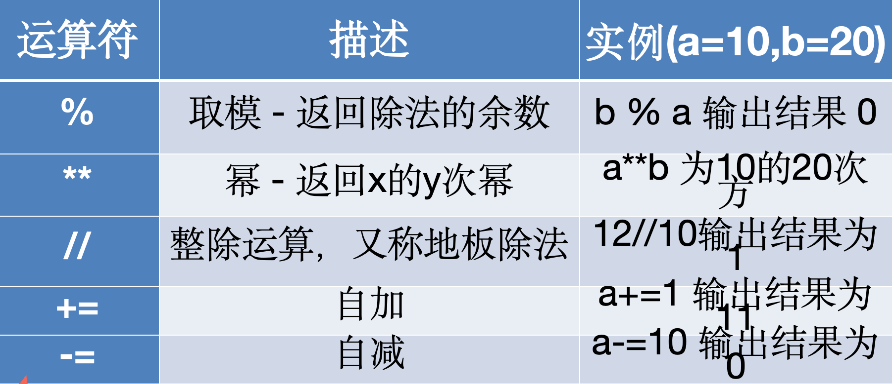
```py
# 算术运算符
a, b = 10, 3
print(a + b)  # 13
print(a - b)  # 7
print(a * b)  # 30
print(a / b)  # 3.333... (真除法)
print(a // b) # 3  整除 ->取整数商
# 例如 N // 5， N = 12
# 12 // 5 ，表示 12 除以 5 的整数商，12 除以 5 商为 2 余 2，取整数商结果是 2 。

print(a % b)  # 1 (取模)
print(a ** b) # 1000 (幂运算)

# 比较运算符
print(5 > 3)  # True
print(5 == 5) # True

# 逻辑运算符
print(True and False)  # False
print(True or False)   # True
print(not True)        # False
```
### 1.4 字符串下标 / eval函数
```py
s = "Python编程"
print(len(s))           # 8 (中文算1个字符)
print(s[0])             # 'P'
print(s[-1])            # '程'
print(s[2:5])           # 'tho' (切片)

# eval函数
num = eval("3 * 5")
print(num) # 输出字符串计算结果 15
print(type(num)) #输出结果数据类型 <class 'int'>
```
### 1.5 运算符
```py
print(s.upper())        # PYTHON编程
print("HELLO".lower())  # hello
print(" python ".strip()) # "python"
print("a,b,c".split(",")) # ['a', 'b', 'c']
```
### 1.6 字符串格式化
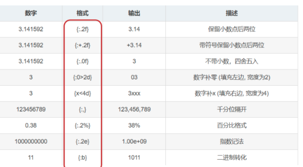

```py
name = "Alice"
age = 25
print(f"{name} is {age} years old")  # f-string (Python 3.6+)
print("{} is {} years old".format(name, age))

# 保留2位小数 3.14
print("{:.2f}".format(3.141592))
# 带符号保留小数点后2位 3.14
print("{:-.2f}".format(3.141592))
# 不带小数，四舍五入 3
print("{:.0f}".format(3.141592))
# 千分位隔开 1,231,213,121
print("{:,}".format(1231213121))

# 数据类型强制转换 
# 将整数转换为浮点数
a = 34
b = float(a) #34.0
print(b, type(b)) # <class 'float'>
```
### 1.7 运算符
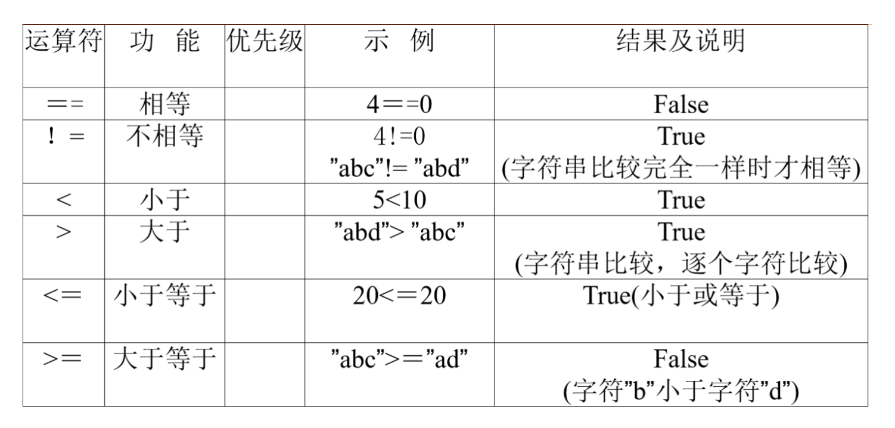

```py
x, y = 5, 10
print(x == y)   # False
print(x != y)   # True
print(x < y)    # True
print(x >= 5)   # True
```

### 1.8 赋值操作符
```py
num = 10
num += 5  # 等同于 num = num + 5
print(num)  # 15
```
### 1.9 逻辑判断 or / and/ not

```py
# 逻辑判断 or - 或

num = int(input("请输入指针对准的数字"))
if num == 5 or num == 9:
    print("奖励你一个大鸡腿")
else:
    print("奖励你一个小鸡腿")


# 逻辑判断 and - 与
cScore = int(input("请输入你的语文成绩： "))
mScore = int(input("请输入你的数学成绩： "))

if cScore > 90 and mScore > 90:
    print("奖励你一个大鸡腿")
else:
    print("给你一个鸡毛掸子")

# 逻辑判断 not - 非
date = input("今天是周几: ")
if not (date == "周末"):
    print("今天我要上课")
else:
    print("今天放假")
    

```
## 二. 流程控制
### 2.1 条件语句 (if-elif-else)
```py
age = 18
if age < 18:
    print("未成年")
elif age == 18:
    print("刚好成年")
else:
    print("已成年")
```

### 2.2 循环 (for & while)
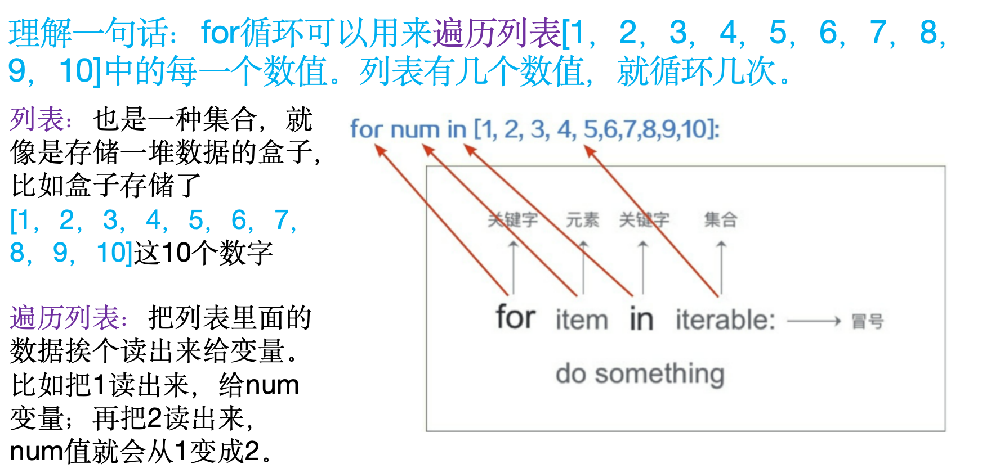
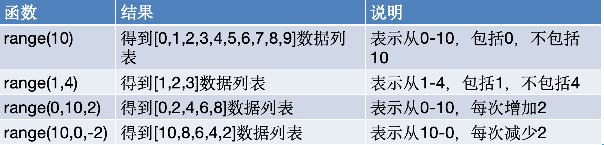
```py
# for 循环
for num in [10, 20 ,30 ,40 ,50]
    print("Hello py")

for i in range(5):  # 0, 1, 2, 3, 4
    print(i)

# while 循环
count = 0
while count < 5:
    print(count)
    count += 1
```
### 2.3 break, continue, else
```py
for i in range(10):
    if i == 5:
        break      # 跳出循环
    if i % 2 == 0:
        continue   # 跳过本次循环
    print(i)
else:
    print("循环正常结束")  # 如果循环没有被 break 中断，则执行

# 列表 (List)
fruits = ["apple", "banana", "cherry"]
fruits.append("orange")  # 添加元素
fruits.remove("banana")  # 删除元素
print(fruits[0])        # 访问元素
print(len(fruits))      # 长度
```

## 三.海龟画图
### 3.1 turtle
```py
import turtle  # 导入turtle 库
# 设置画笔形状为小海龟 arrow，circle，square，triangle，classic
turtle.shape("turtle")

# 行走相关
turtle.forward()  # fd 前走 100像素
turtle.backward()  # bk 后退

# 方向相关
turtle.right()  # rd右转
turtle.left()  # lf左转

turtle.goto(100, 100) # 移动到（100，100）的位置

turtle.speed()  # 改变画笔速度(0最快,10-1逐渐变慢)
turtle.up()  # 函数让画笔抬起
turtle.down()  # 函数让画笔落下
turtle.reset()  # 清除画布内容（还原画笔状态）
turtle.clear()  # 清除画布内容（保留画笔状态）
turtle.ht()  # 函数隐藏画笔图标
turtle.st()  # 显示画笔图标
turtle.bgcolor()  # 改变背景颜色
turtle.circle()  # 画圆（备课请看批注）
turtle.dot()  # 画点
turtle.pensize(15) #设定画笔粗细
turtle.pencolor("yellow")#设置画笔的颜色
turtle.fillcolor()#填充颜色
turtle.color()#设置画笔颜色和填充颜色
turtle.begin_fill()#开始填充颜色
turtle.end_fill()#结束填充颜色
turtle.done() # 结束
```
### 3.2 奥运五环

```py
import turtle  # 导入turtle模块

turtle.color("blue")
turtle.width(20)  # 确定圆圈的宽度
turtle.circle(60)  # 确定圆的半径

turtle.penup()
turtle.forward(140)
turtle.pendown()
turtle.color("black")  # 确定圆圈的颜色
turtle.circle(60)

turtle.penup()
turtle.forward(140)
turtle.pendown()
turtle.color("red")
turtle.circle(60)

turtle.penup()
turtle.goto(210, -50)
turtle.pendown()
turtle.color("green")
turtle.circle(60)

turtle.penup()
turtle.goto(60, -50)
turtle.pendown()
turtle.color("yellow")
turtle.circle(60)
turtle.done()
```

### 3.3 循环海龟
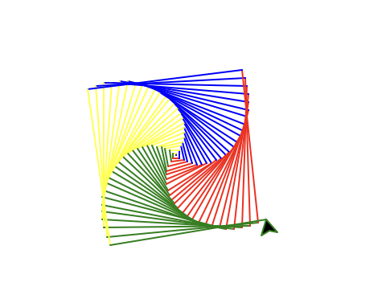

```py
from turtle import *

# fd(0)，左转90度
# fd(1)，即向前移动1个像素，左转90度
# fd(2) ，即向前移动2个像素，左转90度
# fd(99) ，即向前移动99个像素，左转90度。

for i in range(100):
    fd(i)
    lt(90)

for i in range(100):
    circle(i) # 每次画半径为i的圆
    left(91) # 左转91度

# 四色螺旋线
colors= ["red","blue", "yellow", "green"]
for i in range(100):
    pencolor(colors[i % 4])
    fd(i)
    left(91)

done()
```
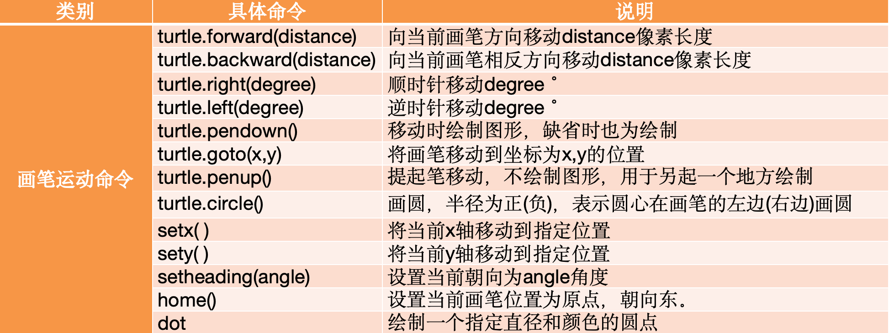
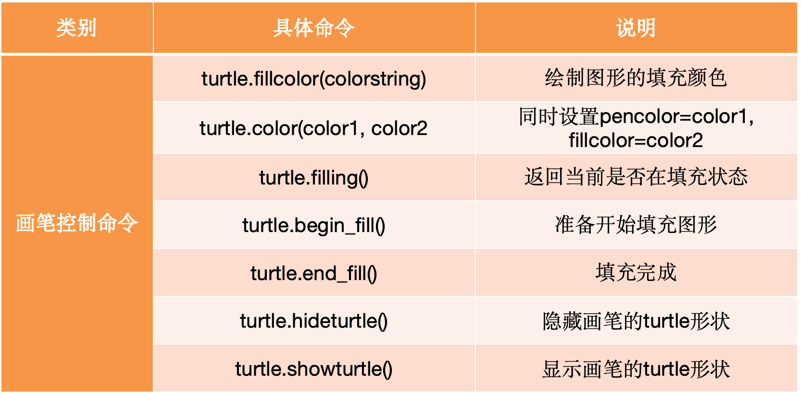
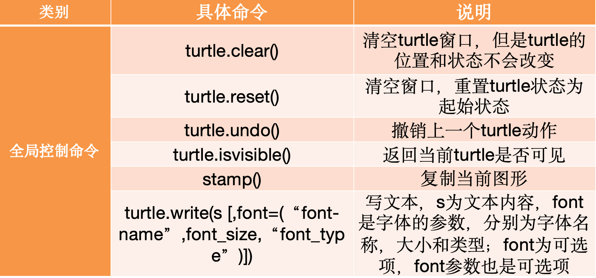
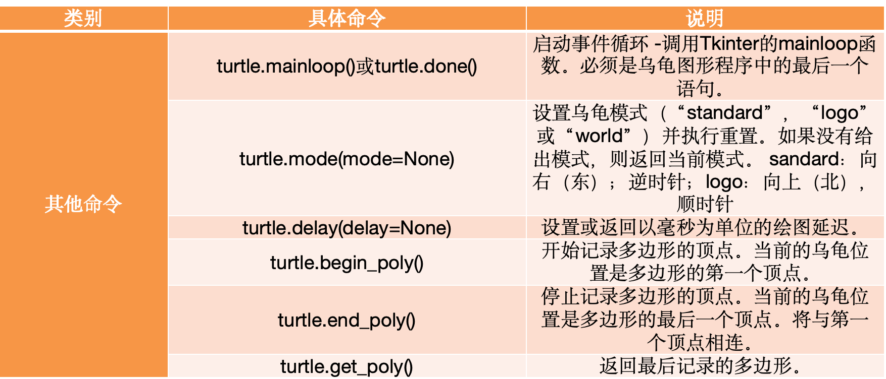

## 四.数学算法
### 4.1 次方 pow()
作用：求解a的b次方
```py
# 求2 的3 次方
x = pow(2,3)
print(x) #8
```
### 4.2 绝对值 abs()
作用：abs函数能够用来求解绝对值
表示方法：绝对值指的是一段距离，通常的表示方法为"两个竖线之间有一个数字"，例如|5|，|-7|

特点：绝对值永远大于等于0，不可能小于0，因为距离不会是负数。正数的绝对值是自己本身，负数的绝对值是它的相反数，0的绝对值是0
```py
x = abs(5)
y = abs(-7)
print(x, y ) # 5 7
```

### 4.3 取商和求余函数divmod()
作用：同时取商和余数，返回的数据是元组类型
* 例题：求解10除3的商和余数。
```py
a = 10
b = 3
print(divmod(a,b))
# (3, 1)
```

### 4.4 求和函数sum()
作用：可以求列表元素之和
* 例题：求解列表[1,3,5,7,9]的元素之和
```py
li = [1,3,5,7,9]
print(sum(li)) # 25
```
### 4.5 四舍五入函数round()
作用：可以指定小数位数，且满足`四舍五入`的规则
* 例题：将小数3.1415926保留3位小数输出
```py
p = 3.1415926
print(round(p, 3)) # 3.142
```
### 4.6 最大值函数max()
作用：可以求出列表当中数据的最大值
* 例题：求列表[5,3,99,2,0]当中的最大值
```py
li = [5,3,99,2,0]
print(max(li)) # 99
```
### 4.7 最小值函数min()
* 作用：可以求出列表当中数据的最小值
```py
li = [5,3,99,2,0]
print(min(li)) # 0
```
### 4.8 整除问题
* `尾数判别法`
* 除数 2、5 看被除数的末尾 
* 除数 4、25 看被除数的末两位
* 除数 8、125 看被除数的末三位
### 4.9 质数与合数
* 质数：像2、3、5……这样只有1和它本身两个因数的数叫`质数`(或素数)
* 合数：像4、6、9……这样除了1和它本身，还有其它因数的数，叫做`合数`
* 注意：1只有1个因数，既不是质数，也不是合数

判断一个数是否为质数（素数） ？

* 1. 方法一： 统计x的因数个数
```py

# 找质数
x = int(input('请输入您要判断的数字：'))
s = 0
for i in range(1, x+ 1):
    if x % i ==0:
        s +=1
if s == 2:
    print('%d 为质数' %x)
```
* 2. 方法二： 试除法

输入一个数 x -> for 循环试除 -> 发现整除 -> x 不为质数
* 结论： 若要判断x是否为素数，只需判断1-根号x中是否有它的因子即可。
```py
import math
x = int(input("请输入您要判断的数字："))
p = int(math.sqrt(x)) + 1
flag = True

for i in range(2, p):
    if x % i == 0:
        flag = False
        print('%d 不为质数' % x)
        break
if flag:
    print('%d 为质数' %x)
```

### 4.10 同余
余数：在整数的除法中，只有能整除与不能整除两种情况。当不能整除时，就产生余数，`取余数运算 a mod b = c（b不为0）表示整数a除以整数b所得余数为c`。例如：7÷3 = 2…1

同余：`除以同一个数，余数相等`， 例如，7÷3 = 2…1、4÷3=1…1，称7和4对3这个数同余，`3称为7和4同余的模`。7和4对3同余，13和7对3同余，那么13和4对3也同余。
* 性质：若a mod b = c，d mod b = c，设a<d，那么(d-a)%b等于0

例子： 23、51、72三个数，各除以一个大于1的自然数，得到的余数相等，这个数是多少？

思路：根据同余的性质，`若a mod b = c，d mod b = c，设a<d，那么(d-a)%b等于0`。因为 51-23=28，则这个数是28的约数；因为72-51=21，则这个数是21的约数；说明这个数既能把28整除，也能把21整除，那么28和21的公约数就是7了。
```py
for i in range(2, 73):
    if 23%i == 51 % i and 51 % i == 72%i:
        print(i)
        break

```

### 4.11 最大公约数
最大公约数指的是两个数的公共因数中最大的数
* 方法一：试除法
* 例如：12与6的最大公约数为6
思路：假设存在两个数m和n，则选取这两个数中较小的数（设为i），然后判断i能否同时成为m与n的因数，如果可以，则i就是m与n的最大公约数；如果不可以，则递减i，直到满足条件为止。

例子： 12与8的最大公约数
```py
m = int(input())
n = int(input())
if m > n:
    i = n
else:
    i = m
for x in range(i, 0 , -1):
    if m %x == 0 and n %x == 0:
        print(x)
        break

```
* 方法二： 辗转相除法

求m,n的最大公约数，除了普通的试除法之外，还有什么其它方法吗？

思路：假设求解36、24的最大公约数

第一步：36为被除数，24为除数，余数为12

第二步：24为被除数，12为除数，余数为0，得出结果，12为36与24的最大公约数
* 例子 99与36的最大公约数是多少呢？
```py
m = int(input())
n = int(input())
while m % m !=0:
    c = m % n
    m = n
    n = c
print(n)
```
### 4.12 最小公倍数
最小公倍数指的是两个数的公共倍数中最小的数

思路：假设存在两个数m和n，则选取这两个数中较大的数（设为j），然后判断j能否同时被m与n整除(即取余等于0)，如果可以，则j就是m与n的最小公倍数；如果不可以，则递增j，直到满足条件为止。

* 例如：2与3的最小公倍数为6
```py
m = int(input())
n = int(input())
if m > n:
    j = m
else:
    j = n
while True:
    if j %m == 0 and j %n == 0:
        print(j)
        break
    j+=1

```
## 五.列表 list []
数据处理通常会涉及到很多数据，这些数据需要一个容器进行管理。
可以把列表理解为是一个`管理数据的容器`。列表中的每一项数据称为元素
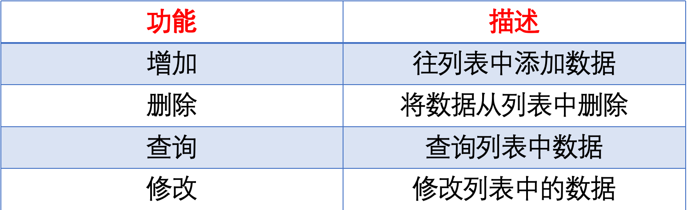
### 5.1 拼接
* 列表是有序的
* 列表中数据的类型可以是不同的
* 列表中的数据从0开始编号
```py
list1 = ['小红', '小绿', '小蓝']
list2 = ['小青', '小西']
print(list1 + list2)
# ['小红', '小绿', '小蓝', '小青', '小西']
```
* 判断 一个数是否在 列表中 用 a in list
```py

s = ['水星', '金星', '火星', '地球', '木星']
if '水星' in s:
    print('YES')
else:
    print('NO')
```
### 5.2 列表的索引
```py
s = ['水星', '金星', '火星', '地球', '木星']
# 根据索引截取 不包含结尾索引
print(s[1: 4])
# ['金星', '火星', '地球']
```
* 利用index函数查询指定数据元素的索引位置，没有查到则报错
```py
index_list = [12, 35, 56,23, 56]
print(index_list.index(35)) # 1
# 利用count函数统计数据在列表中出现的次数
print(index_list.count(56)) # 2
```
### 5.3 append 追加
```py
s = ['水星', '金星', '火星', '地球', '木星']
s.append('北极星')
print('追加 一个元素 append', s)
# ['水星', '金星', '火星', '地球', '木星', '北极星']
```
* 5.4 extend 追加多个元素 
```py
s = ['水星', '金星', '火星', '地球', '木星']
s.extend(['天狼星', '一闪一闪亮晶晶'])
print('追加多个元素extend:', s)
# ['水星', '金星', '火星', '地球', '木星', '北极星', '天狼星', '一闪一闪亮晶晶']
```
### 5.5 insert 插入 元素
```py
s = ['水星', '金星', '火星', '地球', '木星']
s.insert(2, 'insert')
print('insert:', s)
# ['水星', '金星', 'insert','火星', '地球', '木星']
```

### 5.6 remove 删除 
```py
s = ['水星', '金星', 'insert','火星', '地球', '木星']
s.remove('insert')
print('remove:', s)
# ['水星', '金星','火星', '地球', '木星']
```
* 删除列表中指定位置的数据元素，如果没有指定位置
* 则删除最后一个元素
```py
s = ['水星', '金星', '火星', '地球', '木星']
s.pop()
s.pop(2)
print('pop:', s)
```
###  5.7 del关键字删除指定的列表元素
```py
s = ['水星', '金星', '火星', '地球', '木星']
del s[0]
print('del:', s)
# ['金星', '火星', '地球', '木星']
```
* clear函数清除列表中所有的数据
###  5.8 index查找
* 利用index函数查询指定数据元素的索引位置，没有查到则报错
```py
index_list = [12, 35, 56,23, 56]
print(index_list.index(35)) # 1
```
###  5.9 count 次数
* 利用count函数统计数据在列表中出现的次数
```py
index_list = [12, 35, 56,23, 56]
print(index_list.count(56)) # 2

```
### 5.10 sort函数
* 利用sort函数对列表数据进行升序排列
```py
index_list = [12, 35, 56,23, 56]
index_list.sort()
print(index_list) # [12, 23, 35, 56, 56]
```
## 六 元组 tuple ()
* 元组用( )来定义，元素之间用逗号隔开
* 在定义元组的时候，如果只有一个元素，必须在其末尾加上逗号，否则，数据类型就是这一个元素的数据类型。
* 作用：将一系列的同类型或不同类型的元素组合在一起
* 特点：元组中的数据元素是不可以修改的

### 6.1 定义元组
```py
a = (22, "toys", "boys", 5.20)
print(type(a)) # <class 'tuple'>
```
* 结合 for
```py
a = (22, "toys", "boys", 5.20)
for i in a:
    print(i, end= ' ')
```

### 6.2 增加
* 元组数据元素的增加,可以通过+号生成一个新元组
```py
a = (22, 23, 25)
b = a + (24,)
print(b) # (22, 23, 25, 24)

```
### 6.3 查询
* 利用索引/下标可以查询元组中某个特定的数据元素，
* 利用index函数可以查询数据首次出现时的索引位置
```py
a = (123,456,789)
print(a[1]) # 456
```
```py
a = (123,456,789)
pos = a.index(456)
print(pos) # 456
```
### 6.4 插入
```py
a = (1,2,3,4,5,6,8,9)
b = a[:6:] + (7, ) + a[6:]
print(b) #(1, 2, 3, 4, 5, 6, 7, 8, 9)
```

### 6.5 类型转换
list(元组)：将元组转换为列表类型
tuple(列表)：将列表转换为元组类型
```py
a = (1, 2, 3, 4, 5, 6, 7, 8, 9)
list = list(a)
print(list) #[1, 2, 3, 4, 5, 6, 7, 8, 9]
tuple = tuple(list)
print(tuple) #(1, 2, 3, 4, 5, 6, 7, 8, 9)

```
### 6.6 元组的切片操作
tup[start:stop:step] 用于获取元组的部分元素
```py
tup = (1,2,3,'1','2','3')
print(tup[0::2]) #(1, 3, '2')
```

## 七 集合 set {}
* 作用：将一系列的同类型或不同类型的不同元素放在一起
* 特点：数据在集合中是无序的，唯一的，集合类型用`set`表示。
* 定义格式：集合用{  }来定义，元素之间用逗号隔开
* 注意点：因为`集合无序`，因此不允许使用下标访问元素
### 7.1 定义
```py
a = {'apple', 'banana', 'cherry', 'apple', 'apple'}
print(a) # {'apple', 'banana', 'cherry'}

# 集合的无序性
a = {9,2,5,1}
print(a) #{9, 2, 5, 1}

```
### 7.2 集合遍历
```py
a = {'apple', 'banana', 'cherry', 'apple', 'apple'}
for i in a:
    print(i)
# apple
# banana
# cherry
```
### 7.3 add 集合数据插入
```py
a = {'apple', 'banana', 'cherry', 'apple', 'apple'}
a.add('python')
print(a) # {'python', 'apple', 'banana', 'cherry'}
```
* update 批量添加
```py
a = {'apple', 'banana', 'cherry', 'apple', 'apple'}
a.update({'apple2','apple3','apple4'})
print('批量添加', a)
```
### 7.4 删除 discard
* discard函数可以删除集合中的某个元素
```py
s = {1,2,3,4}
s.discard(2)
print(s) # {1, 3, 4}

```
###  7.5 删除 remove
* remove函数如果没有找到对应的数据元素，会报错！
```py
s = {1,2,3,4}
s.remove(3)
print(s) # {1,2,4}
```
###  7.6 clear
* 利用clear函数可以清除集合中所有的元素
```py
s = {1,2,3,4}
s.clear()
print(s) # set{}
```
###  7.7 判断数据元素是否存在于集合中
```py
s = {'a','b','c','d','e','f','g'}
if 'u' not in s:
    print('你真棒')
else:
    print('被错了')
# 你真棒
```

* 例子
* 水果被放入到一个列表中，请你用集合帮计算一下一共有多少种水果。
```py
fruits = ['apple', 'banana', 'cherry']

# 强转 元祖  强转集合， 打印集合长度
# print(len(tuple(fruits)), type(set(fruits)), len(set(fruits)))
s = set()
for i in fruits:
    s.add(i)
print(s, type(s), len(s))
# {'banana', 'apple', 'cherry'} <class 'set'> 3
```
元组转集合
```py
python = set(['apple', 'banana', 'cherry'])
c = set(['1','2','3'])
python.update(c)
print(python) # {'cherry', '2', '1', '3', 'apple', 'banana'}
```
### 7.8  | 并运算
* 作用：将两个集合的元素组合在一起
* 符号：用 | 进行表示
```py
set1 = {'A', 'B', 'C'}
set2 = {'A', 'E', 'F'}
set3 = set1 | set2
print(set3) #{'E', 'B', 'C', 'A', 'F'}
```
### 7.9 & 交运算
* 作用：将两个集合共同的元素组合在一起
* 符号：用 & 进行表示
```py
set1 = {'A', 'B', 'C'}
set2 = {'A', 'E', 'F'}
set4 = set1 & set2
print(set4) #{'A'}
```
### 7.10 - 差运算
* 作用：从一个集合中排除另一个集合的元素 ，得到只属于第一个集合的元素组成的新集合。
* 符号：用 - 进行表示
```py
# 对集合set1和set2进行差运算，从集合set1中排除集合set2的元素。
# 集合set2中的'A'和'E'在集合set1中也存在，执行差运算后，这两个元素被排除，只剩下'C' ，所以set3为{'C'} 。
set1 = {'A', 'E', 'C'}
set2 = {'A', 'E', 'F'}
set3 = set1 - set2
print(set3)  #{'C'}
```
### 总结

* 元组存储批量数据，用(  )定义，数据元素用逗号隔开，元组的索引从0开始，元组中的数据元素不可修改
* 集合存储批量数据，用{  }定义，数据元素用逗号隔开，集合中的数据元素不可重复，没有顺序
### 元组的操作函数
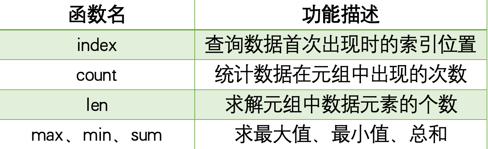
### 集合的操作函数
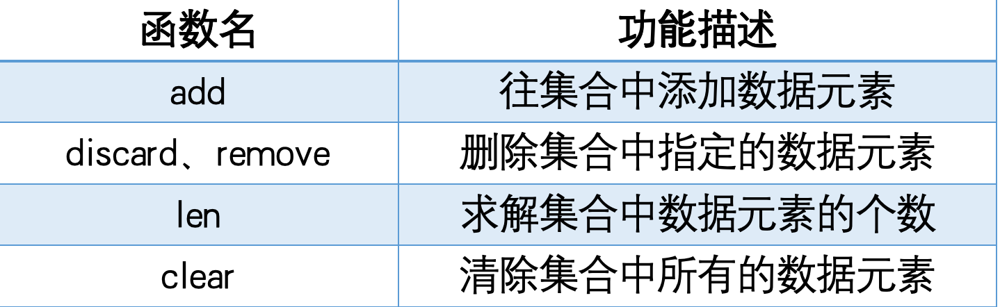

## 八 字典 dict {key: value}
* 字典的作用：存储数据，存储具有`映射关系`的数据 {key: value}
* 字典能够存储多组值，一组值包含两个元素 – key和value
* 在python中，字典数据类型用dict表示，`字典用{ }进行定义`
* 每一组数据的key(键)和value(值)之间用冒号隔开，如上所示，总共有3组数据，`一组数据又称为一个键值对`
### 8.1 定义
例如： 语文(关键数据 key) -> 79 (值 value)
```py
d = {'语文': 79, '数学': 80, '英语': 92}
print(type(d)) #<class 'dict'>
print(d)
```
### 8.2 查询 字典名[键]
* 通过key(键)可以得到对应的value(值)
> 字典中的key(键)必须是唯一的，否则会存在键值对覆盖的情况

> 如果访问字典中不存在的键所对应的值，那么程序会报错


```py
d = {'语文': 79, '数学': 80, '英语': 92}
print(d['语文']) #79

#  value(值)可以存储任何类型，但是key(键)必须是字符串、数字或者元组
d = {
    'age': 20,
    ('name'): 'Tom',
    19: 29
}
print(d['age'])
print(d[('name')])
print(d[19])
```
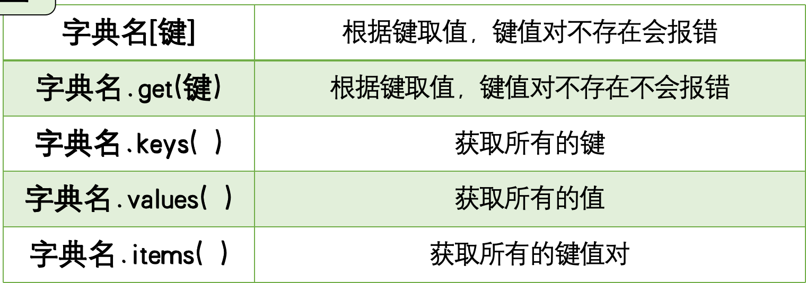

### 8.3 for in
说明：可使用for循环遍历，取出所有键以及键对应的值，在遍历的时候，k的值是d字典中的键
```py
d = {'语文': 79, '数学': 80, '英语': 92}
for k in d:
    print(k, d[k])
# 语文 79
# 数学 80
# 英语 92
```
### 8.4 字典名.get(键)
```py
d = {'语文': 79, '数学': 80, '英语': 92}
print(d.get('数学')) # 80
```
### 8.5 字典名.keys( )
说明：keys函数能够获取所有的键，之后可通过for循环取出每一个键元素。
```py
d = {'语文': 79, '数学': 80, '英语': 92}
print(d.keys()) # dict_keys(['语文', '数学', '英语'])
print(d.values()) # dict_values([79, 80, 92])
```
### 8.6 字典名.items( )
```py
d = {'语文': 79, '数学': 80, '英语': 92}
print(d.items()) #dict_items([('语文', 79), ('数学', 80), ('英语', 92)])

for k in d.items():
    print('items: k:', k)
# items: k: ('语文', 79)
# items: k: ('数学', 80)
# items: k: ('英语', 92)

for k,v in d.items():
    print(k,v)
# 语文 79
# 数学 80
# 英语 92
```
### 8.7 修改字段元素值 d['语文'] = 100
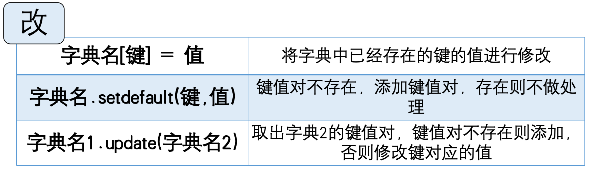

```py
d = {'语文': 79, '数学': 80, '英语': 92}
d['语文'] = 100
print(d) # {'语文': 100, '数学': 80, '英语': 92}
```
* setdefault
* 说明：键值对不存在，添加键值对，存在则不做处理
```py
d = {'语文': 79, '数学': 80, '英语': 92}
d.setdefault('语文', 85)
d.setdefault('体育', 85)
print(d)
# {'语文': 79, '数学': 80, '英语': 92, '体育': 85}
```
* update
* 取出d2的键值对，键值对不存在则添加，否则修改键对应的值

```py
d = {'语文': 79, '数学': 80, '英语': 92}
d2 = {'语文': 85, '数学': 80, '英语': 92}
d.update(d2)
print(d)
```
### 8.8 增加 字典名[键] = 值
往字典中添加键值对，键要和字典中的键不同，如果相同，会修改字典中键对应的值
```py
d = {'语文': 79, '数学': 80, '英语': 92}
d['体育'] = 100
# {'语文': 79, '数学': 80, '英语': 92, '体育': 100}
```
### 8.9 删除 
* del 字典名[键]	删除指定的键值对
* 字典名.pop(键)	删除指定的键值对
* 字典名.clear( )	清除字典中所有的键值对

```py
d = {'语文': 79, '数学': 80, '英语': 92, '体育': 100}
d.pop('体育')
print(d) # {'语文': 85, '数学': 80, '英语': 92}
```
### 8.10 zip函数
* 作用：可以将两个列表对应的数据元素组合成一个元组
```py
list1 = ['语文','数学','英语']
list2 = [85, 100, 23]
print(list(zip(list1, list2)))
# [('语文', 85), ('数学', 100), ('英语', 23)]
```

## 九 异常 try-except finally
* 异常处理机制
当程序执行到错误代码的时候，`程序直接报错，导致程序提前结束`，无法正常执行完所有功能，这就是我们所说的`'异常'`。

### 9.1 NameError
* 当变量b未定义时 捕获NameError异常，异常信息存入msg中，打印输出，程序继续执行。
```py
try:
    print(b)
except NameError as msg:
    print(msg)
# name 'b' is not defined
```
### 9.2 ZeroDivisionError
* 当除数为0时
```py
try:
    print(1/0)
except ZeroDivisionError as msg:
    print('出现异常啦！')
# division by zero
```
### IndexError
列表下标越界
```py
try:
    list = [1, 2,3,4]
    print(list[10])
except IndexError as msg:
    print(msg)
# list index out of range
```
## 十.函数
用法同上：⬆️
内置函数： pow函数、abs函数、sum函数、round函数等

函数分为两大类：
 （1）系统内置函数(或者称为内建函数)
 （2）用户自定义函数

### 10.1 bool函数
语法：bool(参数x)，x为参数，代表待处理的数据，需要用户传递

规则1：当对数字使用bool函数时，只有参数是0时bool函数返回False，任何其它参数值都返回True
```py
x = 3
print(bool(x)) #True
```
### 10.2 float函数
作用：float函数能够把字符串或者数字转成浮点数，所谓的浮点数指的是带有小数点的数字
```py
x = 3
print(float(x)) #3.0
```
### 10.3 len函数
len函数可以求得字符串、列表、元组等的长度或元素个数

```py
s = 'Hello'
print(len(x)) # 5
```
### 10.4 sorted函数
默认情况下它会返回一个升序序列
```py
list_A = [3,5,2,4]
print(list_A)
#  reverse = True 降序  reverse = False 升序
list_B = sorted(list_A, reverse = True)
print(list_B) # [5,4,3,2]

```
### 10.5 ord() 函数
获取单个字符的 Unicode 编码值 ，字符"A" 的 Unicode 编码值是 65 
```py
print(ord('A')) # 65
```
### 自定义函数
函数的三大要素： 函数名， 参数， 函数体
* def 函数关键字 
* 在用def关键字定义函数时`函数后面括号里的变量`称为形式参数 params 称为`形式参数`,用来接收外部数据. 形参没有实际的值，被赋值后才有意义。
* 实参全称实际参数，`是指调用函数时，小括号中的参数`，是用来把数据传递给形式参数用的。 实际参数可以是`变量`，也可以是一个`常量`。'小明'/name 称为`实际参数`
```py
def myName(params):
    print('我叫 XXX', params)

name = input('请输入姓名：')
myName('小明')
myName(name)
```
### 参数
* `默认参数`，又称为缺省参数，即我们可以给形式参数一个默认值
* 实际参数，那么会覆盖参数的默认值
* 有默认值的形式参数不能跟在有默认值的形式参数后面 例如错误写法 myName(params = '小明', b), 正确写法 myName( b, params = '小明',)
```py
def myName(params = '小明'):
    print('我叫 XXX', params)
name = input('请输入姓名：')
myName(name)
```
不定长的参数 `只需一个*加上一个形式参数`,这个形式参数里面存放了所有未命名的形式参数，且这个`形式参数的类型是一个元组`。
```py
def getComputer(*args):
    print(args)

getComputer(1,2,3,4)
#(1,2,3,4)
```
关键字可变参数用**来声明，它和可变参数的区别在于关键字参数是一个字典类型，并且参数的key值必须是一个字符串。
```py
def getComputer(*args):
    print(args)

dictA = {"name": "小明", "age": 26}
# 可变参数
getComputer(**dictA) #{"name": "小明", "age": 26}

#实际参数:  传递的实际参数的key键必须是字符串，否则报如下错误
getComputer(name: "小妹", age = 27) #{"name": "小妹", "age": 27}
# 可选参数必须放到关键字参数之前，不然会报语法错误
```
### 函数的返回值
* 如果在函数内部有return，就可以返回实际的值。如果函数没有返回值，那么返回的是None(空)
* 函数可以返回任何类型的数据，返回值的类型取决于return后面的类型
* 如果函数有返回值，那么在哪个地方调用函数，函数的返回值就返回到哪个地方
* 在一个函数体内可以出现多个return值，但是肯定只能返回一个return
* return可以返回多个值，多个值以元组的数据类型返回
```py
def printInfo(n):
    if n % 2 == 0:
        return 1
    else:
        return 0

v = int(input('请输入要判断的奇偶性的数字：'))
result = printInfo(v)
if n % 2 == 0:
    print("偶数")
else:
    print("奇数")
```

### 函数的名称规范
在编写自定义函数时，函数名字的命名最好见名知意，比如编写一个求和的自定义函数，可以命名为getSum，编写一个打印信息的自定义函数，可以命名为printInfo。
