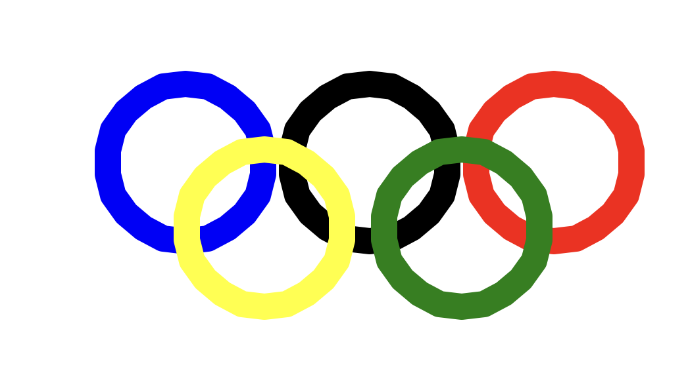

* Python 是一门简单易学但功能强大的编程语言，适合初学者和高级开发者。以下是 Python 的必知必会基础知识，涵盖核心语法、数据结构、函数、面向对象编程、文件操作、异常处理等关键内容。
## 1.Python 基础语法
### 1.1 变量与数据类型
```py
# 打印输出
print("Hello, Python!")  # 这是单行注释

"""
这是多行注释
可以写多行说明
"""

# 变量命名规则
# 由字母，数字，以及下划线组成
# 不能以数字开头,没有长度的限制,严格区分大小写
# 不能使用Python关键字

my_var = 10  # 小写字母，单词间用下划线
MyVar = 20   # 驼峰命名法(不推荐)
_var = 30    # 私有变量约定


# 基本数据类型
integer = 10          # 整数 (int)
floating = 3.14        # 浮点数 (float)
complex_num = 1 + 2j     # 复数
string = "Python"  # 字符串 (str)
boolean = True    # 布尔值 (bool)


# 类型检查
print(type(integer))     # <class 'int'>
print(isinstance(string, str))  # True

# 类型转换
str_num = str(123)       # "123"
int_num = int("456")     # 456
float_num = float("7.89") # 7.89

num_str = "123"
num_int = int(num_str)  # 字符串 → 整数
```
### 1.2 输入与输出
```py
# 输入
name = input("请输入你的名字: ")  # 返回字符串

# 输出
print("Hello,", name)  # 自动加空格
print(f"Hello, {name}!")  # f-string (Python 3.6+)
```

### 1.3 运算符

```py
# 算术运算符
a, b = 10, 3
print(a + b)  # 13
print(a - b)  # 7
print(a * b)  # 30
print(a / b)  # 3.333... (真除法)
print(a // b) # 3 (地板除)
print(a % b)  # 1 (取模)
print(a ** b) # 1000 (幂运算)

# 比较运算符
print(5 > 3)  # True
print(5 == 5) # True

# 逻辑运算符
print(True and False)  # False
print(True or False)   # True
print(not True)        # False
```
### 1.4 字符串下标 / eval函数
```py
s = "Python编程"
print(len(s))           # 8 (中文算1个字符)
print(s[0])             # 'P'
print(s[-1])            # '程'
print(s[2:5])           # 'tho' (切片)

# eval函数
num = eval("3 * 5")
print(num) # 输出字符串计算结果 15
print(type(num)) #输出结果数据类型 <class 'int'>
```
### 1.5 运算符
```py
print(s.upper())        # PYTHON编程
print("HELLO".lower())  # hello
print(" python ".strip()) # "python"
print("a,b,c".split(",")) # ['a', 'b', 'c']
```
### 1.6 字符串格式化


```py
name = "Alice"
age = 25
print(f"{name} is {age} years old")  # f-string (Python 3.6+)
print("{} is {} years old".format(name, age))

# 保留2位小数 3.14
print("{:.2f}".format(3.141592))
# 带符号保留小数点后2位 3.14
print("{:-.2f}".format(3.141592))
# 不带小数，四舍五入 3
print("{:.0f}".format(3.141592))
# 千分位隔开 1,231,213,121
print("{:,}".format(1231213121))

# 数据类型强制转换 
# 将整数转换为浮点数
a = 34
b = float(a) #34.0
print(b, type(b)) # <class 'float'>
```
### 1.7 运算符


```py
x, y = 5, 10
print(x == y)   # False
print(x != y)   # True
print(x < y)    # True
print(x >= 5)   # True
```

### 1.8 赋值操作符
```py
num = 10
num += 5  # 等同于 num = num + 5
print(num)  # 15
```
### 1.9 逻辑判断 or / and/ not

```py
# 逻辑判断 or - 或

num = int(input("请输入指针对准的数字"))
if num == 5 or num == 9:
    print("奖励你一个大鸡腿")
else:
    print("奖励你一个小鸡腿")


# 逻辑判断 and - 与
cScore = int(input("请输入你的语文成绩： "))
mScore = int(input("请输入你的数学成绩： "))

if cScore > 90 and mScore > 90:
    print("奖励你一个大鸡腿")
else:
    print("给你一个鸡毛掸子")

# 逻辑判断 not - 非
date = input("今天是周几: ")
if not (date == "周末"):
    print("今天我要上课")
else:
    print("今天放假")
    

```
## 2. 流程控制
### 2.1 条件语句 (if-elif-else)
```py
age = 18
if age < 18:
    print("未成年")
elif age == 18:
    print("刚好成年")
else:
    print("已成年")
```

### 2.2 循环 (for & while)


```py
# for 循环
for num in [10, 20 ,30 ,40 ,50]
    print("Hello py")

for i in range(5):  # 0, 1, 2, 3, 4
    print(i)

# while 循环
count = 0
while count < 5:
    print(count)
    count += 1
```
### 2.3 break, continue, else
```py
for i in range(10):
    if i == 5:
        break      # 跳出循环
    if i % 2 == 0:
        continue   # 跳过本次循环
    print(i)
else:
    print("循环正常结束")  # 如果循环没有被 break 中断，则执行

# 列表 (List)
fruits = ["apple", "banana", "cherry"]
fruits.append("orange")  # 添加元素
fruits.remove("banana")  # 删除元素
print(fruits[0])        # 访问元素
print(len(fruits))      # 长度
```

## 3.海龟画图
### 3.1 turtle
```py
import turtle  # 导入turtle 库
# 设置画笔形状为小海龟 arrow，circle，square，triangle，classic
turtle.shape("turtle")

# 行走相关
turtle.forward()  # fd 前走 100像素
turtle.backward()  # bk 后退

# 方向相关
turtle.right()  # rd右转
turtle.left()  # lf左转

turtle.goto(100, 100) # 移动到（100，100）的位置

turtle.speed()  # 改变画笔速度(0最快,10-1逐渐变慢)
turtle.up()  # 函数让画笔抬起
turtle.down()  # 函数让画笔落下
turtle.reset()  # 清除画布内容（还原画笔状态）
turtle.clear()  # 清除画布内容（保留画笔状态）
turtle.ht()  # 函数隐藏画笔图标
turtle.st()  # 显示画笔图标
turtle.bgcolor()  # 改变背景颜色
turtle.circle()  # 画圆（备课请看批注）
turtle.dot()  # 画点
turtle.pensize(15) #设定画笔粗细
turtle.pencolor("yellow")#设置画笔的颜色
turtle.fillcolor()#填充颜色
turtle.color()#设置画笔颜色和填充颜色
turtle.begin_fill()#开始填充颜色
turtle.end_fill()#结束填充颜色
turtle.done() # 结束
```
### 3.2 奥运五环

```py
import turtle  # 导入turtle模块

turtle.color("blue")
turtle.width(20)  # 确定圆圈的宽度
turtle.circle(60)  # 确定圆的半径

turtle.penup()
turtle.forward(140)
turtle.pendown()
turtle.color("black")  # 确定圆圈的颜色
turtle.circle(60)

turtle.penup()
turtle.forward(140)
turtle.pendown()
turtle.color("red")
turtle.circle(60)

turtle.penup()
turtle.goto(210, -50)
turtle.pendown()
turtle.color("green")
turtle.circle(60)

turtle.penup()
turtle.goto(60, -50)
turtle.pendown()
turtle.color("yellow")
turtle.circle(60)
turtle.done()
```

### 3.3 循环海龟


```py
from turtle import *

# fd(0)，左转90度
# fd(1)，即向前移动1个像素，左转90度
# fd(2) ，即向前移动2个像素，左转90度
# fd(99) ，即向前移动99个像素，左转90度。

for i in range(100):
    fd(i)
    lt(90)

for i in range(100):
    circle(i) # 每次画半径为i的圆
    left(91) # 左转91度

# 四色螺旋线
colors= ["red","blue", "yellow", "green"]
for i in range(100):
    pencolor(colors[i % 4])
    fd(i)
    left(91)

done()
```


