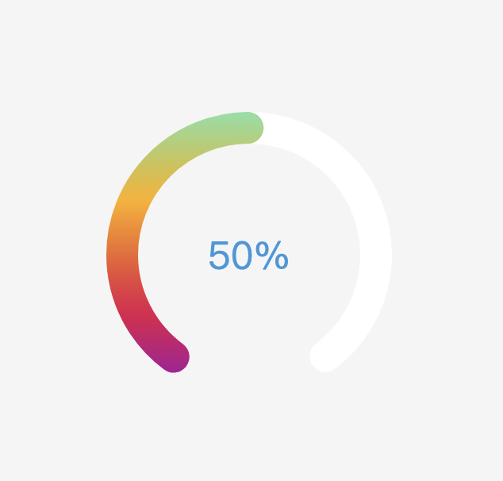

# css命名-BEM
BEM是一种CSS命名规范。
BEM代表 “块（block），元素（element），修饰符（modifier）”。

* -   中划线 ：仅作为连字符使用，表示某个块或者某个子元素的多单词之间的连接记号
* __  双下划线：双下划线用来连接块和块的子元素
* _   单下划线：单下划线用来描述一个块或者块的子元素的一种状态 

* 元素element
```html
/* 常规写法 */ 
  <ul class="list">
    <li class="item">Pricing</li>
    <li class="item">Contact</li>
  </ul>
  
/* BEM写法 */   
   <ul class="list">
    <li class="list__item">Pricing</li>
    <li class="list__item">Contact</li>
  </ul> 

```
```css
/* 常规写法 */ 
.list{} 
.list .item{} 

/* BEM写法 */ 
.list{} 
.list__item{}
  
```

* 修饰符(modifier)

一个“修饰符”可以理解为一个块的特定状态！
```html
/* 常规写法 */ 
  <ul class="list">
    <li class="item">Pricing</li>
    <li class="item">Contact</li>
  </ul>
  
/* BEM写法 */   
  <ul class="list">
    <li class="list__item_active">
      Pricing
    </li>
    <li class="list__item">Contact</li>
  </ul>

```
```css
/* 常规写法 */ 
.list{} 
.list .item{} 
.list .item.active{} 

/* BEM写法 */ 
.list{} 
.list__item{}
.list__item_active{}
```
## process

```html
    <style>
      body {
        display: flex;
        align-items: center;
        justify-content: center;
        height: 100vh;
        margin: 0;
        background-color: #f5f5f5;
      }

      .dashboard {
        position: relative;
        width: 200px;
        height: 200px;
        background-size: 100% 100%;
      }

      .circle-background {
        fill: none; /* 不填充 */
        stroke: #fff; /* 圆环的颜色 */
        stroke-width: 10; /* 圆环的宽度 */
        stroke-dasharray: 200, 52; /* 圆环断开部分的长度，总长度为周长 */
        stroke-dashoffset: 163;
        stroke-linecap: round;
        border-radius: 10;
        transition: all 1s; /* 过渡效果时间 */
      }

      .circle-progress {
        fill: none; /* 不填充 */
        stroke: url(#gradient); /* 圆环的颜色 */
        stroke-width: 10; /* 圆环的宽度 */
        stroke-dasharray: 252, 0; /* 圆环断开部分的长度，总长度为周长 */
        stroke-dashoffset: 163;
        stroke-linecap: round; /* 圆滑断点 */
        transition: all 1s; /* 过渡效果时间 */
      }

      .percentage {
        position: absolute;
        top: 50%;
        left: 50%;
        transform: translate(-50%, -50%);
        font-size: 24px;
        color: #3498db;
      }
    </style>
```
```js
  <body>
    <svg class="dashboard" viewBox="0 0 100 100">
      <!-- 定义渐变色 -->
      <defs>
        <linearGradient
          id="gradient"
          gradientUnits="userSpaceOnUse"
          x1="50"
          y1="0"
          x2="50"
          y2="100%"
        >
          <stop offset="0%" style="stop-color: rgba(111, 232, 191, 1)" />
          <stop offset="33%" style="stop-color: rgba(255, 175, 19, 1)" />
          <stop offset="70%" style="stop-color: rgba(222, 19, 80, 1)" />
          <stop offset="100%" style="stop-color: rgba(133, 14, 205, 1)" />
        </linearGradient>
      </defs>

      <!-- 背景圆环 -->
      <circle class="circle-background" cx="50" cy="50" r="40"></circle>

      <!-- 进度圆环 -->
      <circle class="circle-progress" cx="50" cy="50" r="40"></circle>
    </svg>

    <!-- 进度百分比显示 -->
    <div class="percentage" id="percentage">0%</div>

    <script>
      function setProgress(percentage) {
        const circleProgress = document.querySelector(".circle-progress");
        const circleBackground = document.querySelector(".circle-background");
        const percentageText = document.getElementById("percentage");

        const circumference = 2 * Math.PI * 40; // 圆的周长
        const circumNewLength = (percentage / 100) * (circumference - 52);
        const dashOffset = 163 - circumNewLength;

        // 设置进度圆环的样式
        circleBackground.style.strokeDashoffset = dashOffset;
        circleBackground.style.strokeDasharray = `${200 - circumNewLength}, ${
          52 + circumNewLength
        }`;
        circleProgress.style.strokeDasharray = `${circumNewLength}, ${
          circumference - circumNewLength
        }`;

        // 更新百分比文本
        percentageText.textContent = `${percentage}%`;
      }

      // 设置初始进度为0%
      setProgress(0);

      // 模拟过渡效果，从0%到50%
      setTimeout(() => {
        setProgress(50);
      }, 1000); // 过渡时间为1秒，你可以根据需要调整这个值
    </script>
  </body>
```