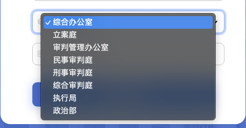
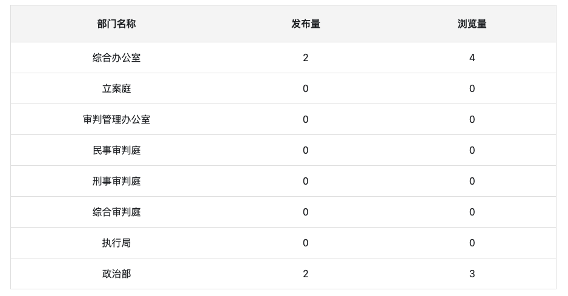
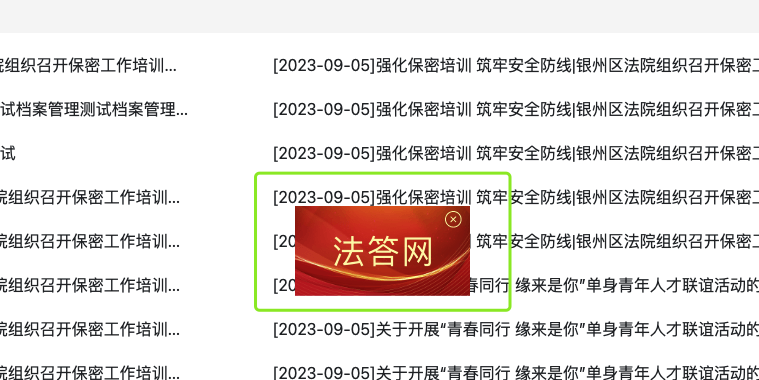

# jquery

## 给元素加 class 样式

```js
$(".news-dynamic-ul li:first-child").addClass("active");
```

## 鼠标悬浮/点击 改变字体颜色

```HTML
<ul id="header-box-left-bottom">
  <li data-id="1">
    书面检索
  </li>
  <li data-id="2">
    数字资源
  </li>
  <li data-id="3">
    文献发现
  </li>
  <li data-id="4">
    站内搜索
  </li>
</ul>
<style>
li.active {
  background: #7D5936;
  color: #fff;
  transition: 0.3s;
}
li:hover{
  background: #7D5936;
  color: #fff;
  transition: 0.3s;
}
</style>
```

```js
$("#header-box-left-bottom li").on("click", function () {
  var id = $(this).data("id");
  var arrTitle = ["", "书面检索", "数字资源", "文献发现", "站内搜索"];
  var title = document.getElementById("header-box-title");
  title.innerText = arrTitle[id];
  $("#header-box-left-bottom > li").each(function () {
    $(this)[$(this).data("id") === id ? "addClass" : "removeClass"]("active");
  });
});
```

## 动态 select




```css
.box-body-item {
  width: 370px;
  display: flex;
  align-items: center;
  background: #ffffff;
  cursor: pointer;
  border-radius: 10px 10px 10px 10px;
  opacity: 1;
  border: 1px solid #c8c8c8;
  padding: 10px;
  margin-bottom: 20px;
}
.box-body-item:hover {
  color: #212529;
  border-color: #86b7fe;
  outline: 0;
  box-shadow: 0 0 0 0.25rem rgba(13, 110, 253, 0.25);
}
.box-body-item select {
  width: 100%;
  border: none;
  padding-left: 10px;
  font-size: 16px;
  font-family: PingFang SC-Regular, PingFang SC;
  font-weight: 400;
}
.box-body-item select:focus-visible {
  outline: none;
}
```

- 动态添加元素

```js
<select name="" id="register-select-deps"></select>;
function deptsListApi() {
  const deptsList = [
    "综合办公室",
    "立案庭",
    "审判管理办公室",
    "民事审判庭",
    "刑事审判庭",
    "综合审判庭",
    "执行局",
    "政治部",
  ];
  // 获取到的元素插入到 select 元素中
  for (var i = 0; i < deptsList.length; i++) {
    $("#register-select-deps").append(
      $("<option/>").text(deptsList[i]).attr("value", deptsList[i])
    ); //动态添加标签
  }
}
// 获取选中select
$("#register-select-deps").on("change", function () {
  // 使用on进行事件绑定事件。
  $("#register-select-deps option:selected").each(function () {
    // jq中的each()方法是遍历的对象的
    console.log($(this).text());
  });
});
```

## 动态 table


innerText 兼容性处理函数

```js
function setInnerText(element, content) {
  if (typeof element.innerText === "string") {
    element.innerText = content;
  } else {
    element.textContent = content;
  }
}
```

```js
// 创建table
var theadDatas = ["部门名称", "发布量", "浏览量"];
// tbody数据
var tbodyDatas = [];
$.get(
  "http://81.70.159.41:17777/content/groupByContendDept/" + type,
  {},
  function (res) {
    if (res.code === 200) {
      tbodyDatas = res.data; // 接口返回的数据
      var table = document.createElement("table");
      table.border = "1px";
      table.style.textAlign = "center";
      listData.appendChild(table);
      // 创建thead
      var thead = document.createElement("thead");
      table.appendChild(thead);
      // 创建thead中的tr
      var tr = document.createElement("tr");
      tr.style.height = "40px";
      tr.style.backgroundColor = "#F5F5F5";
      tr.style.border = "1px solid #E2E2E2;";
      thead.appendChild(tr);
      // 创建thead中的th
      for (var i = 0; i < theadDatas.length; i++) {
        var th = document.createElement("th");
        th.style.padding = "5px 20px";
        // th.innerText = theadDatas[i];
        // 使用common.js中的innerText兼容性处理函数
        setInnerText(th, theadDatas[i]);
        tr.appendChild(th);
      }
      // 创建tbody
      var tbody = document.createElement("tbody");
      table.appendChild(tbody);
      // 创建tbody中的tr td
      for (var i = 0; i < tbodyDatas.length; i++) {
        // 创建tbody中的tr
        tr = document.createElement("tr");
        tbody.appendChild(tr);
        // 创建tbody中的td
        var tdData = tbodyDatas[i];
        for (var key in tdData) {
          var td = document.createElement("td");
          setInnerText(td, tdData[key]);
          tr.appendChild(td);
        }
      }
    }
  }
);
```

## 移动的广告



```css
/* 广告*/
.advert {
  position: fixed;
  left: 0;
  top: 0;
  width: 175px;
  height: 90px;
  z-index: 100;
}
.advert .advert-img {
  width: 175px;
  height: 90px;
}
.advert .close {
  position: absolute;
  right: 0px;
  top: 0px;
  width: 100%;
  text-align: right;
  padding-right: 8px;
}
```

```html
<div class="advert">
  <a href="">
    
  </a>
  <div class="close">
    
  </div>
</div>
```

```js
// 移动的广告
let gg = document.querySelector(".advert"); //  抓取广告框
let close = document.querySelector(".close"); //  抓取关闭按钮
let boxHeight = gg.clientHeight,
  boxWidth = gg.clientWidth; //  获取广告框的宽度和高度
let vw = window.innerWidth,
  vh = window.innerHeight; //  可视窗口大小
let mx = 1,
  my = 1; //  每次移动的像素
let mw = 0,
  mh = 0; //  移动总量
let num = 0; //  点击关闭次数
let maxNum = 3; //  关闭几次后消失
let interval = 0; //  定时器个数
let time = 10; //  定时器时间（运动时）
let closeTime = 1000; //  定时器时间（关闭时）

/*
 * 广告窗移动
 *
 * */
function autoPlay_gg() {
  interval = 0;
  interval = setInterval(function () {
    mw = mw + mx;
    mh = mh + my;
    if (mw >= vw - boxWidth || mw <= 0) {
      mx = -1 * mx;
    }
    if (mh >= vh - boxHeight || mh <= 0) {
      my = -1 * my;
    }
    gg.style.left = mw + "px";
    gg.style.top = mh + "px";
  }, time);
}

autoPlay_gg();

/*
 * 鼠标移动到广告窗上时，暂停移动
 *
 * */

gg.onmousemove = function () {
  clearInterval(interval); //  清除定时器
};
gg.onmouseleave = function () {
  clearInterval(interval);
  autoPlay_gg(); //  广告窗运动
};

/*
 * 点击关闭按钮时
 *
 * */
close.onclick = function () {
  gg.style.display = "none"; //  隐藏广告窗
  num++;
  if (num <= maxNum) {
    setTimeout(function () {
      gg.style.display = "block"; //  显示广告窗
    }, closeTime);
  } else {
    gg.parentNode.removeChild(gg); //  删除广告窗
  }
};
```

## getAttribute() 获取标签属性值

```html
<div class="dep-list">
  <ul>
    <a
      href="javascript:void(0);"
      id="depList"
      value="{ms:global.url/}${field.link}"
    >
      <li>
        
      </li>
    </a>
    <a
      href="javascript:void(0);"
      id="depList"
      value="{ms:global.url/}${field.link}"
    >
      <li>
        
      </li>
    </a>
  </ul>
</div>
```

```js
$(".dep-list ul a").each(function (index) {
  const aTag = $(".dep-list ul a #isNew")[index];
  // a 标签
  const dateText = aTag.getAttribute("alt");
  // dateText 2022-03-12
});
```

## Toast 提示封装

```js
function Toast(msg, duration) {
  duration = isNaN(duration) ? 3000 : duration;
  var m = document.createElement("div");
  m.innerHTML = msg;
  m.style.cssText =
    "font-size: 24px;color: rgb(255, 255, 255);background-color: rgba(0, 0, 0, 0.6);padding: 10px 15px;margin: 0 0 0 -60px;border-radius: 4px;position: fixed;    top: 5%;left: 50%;width: 130px;text-align: center;";
  document.body.appendChild(m);
  setTimeout(function () {
    var d = 0.5;
    m.style.opacity = "0";
    setTimeout(function () {
      document.body.removeChild(m);
    }, d * 1000);
  }, duration);
}
Toast("登录成功", 1000);
```
