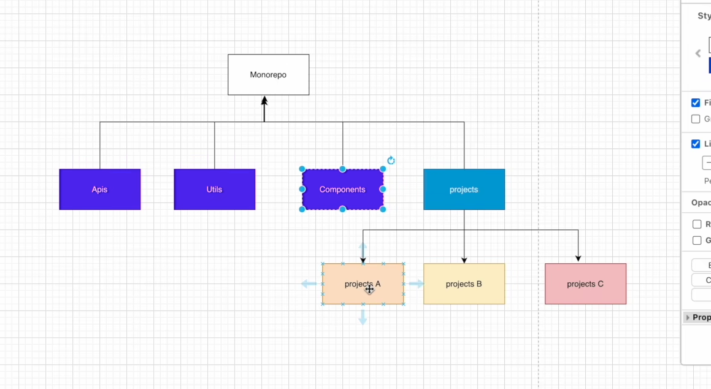
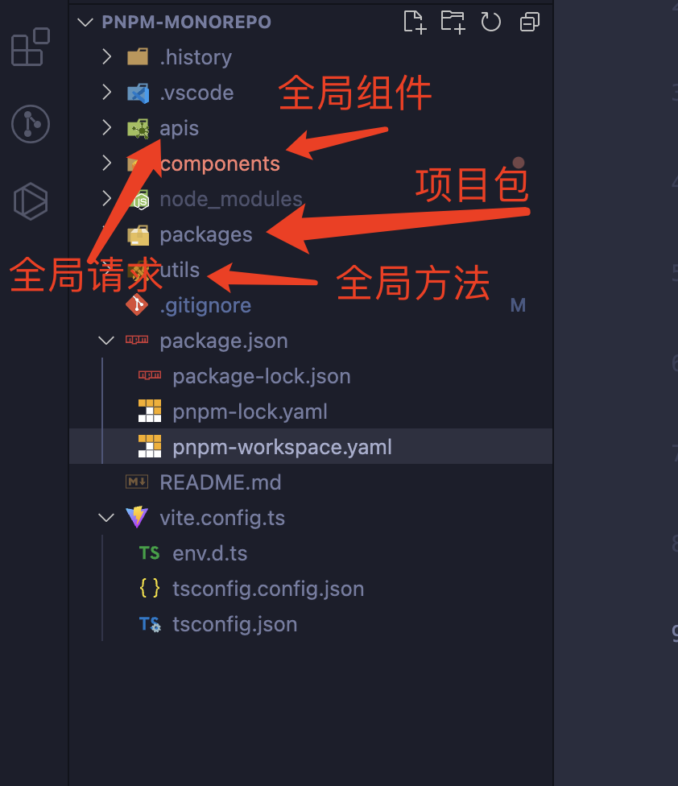
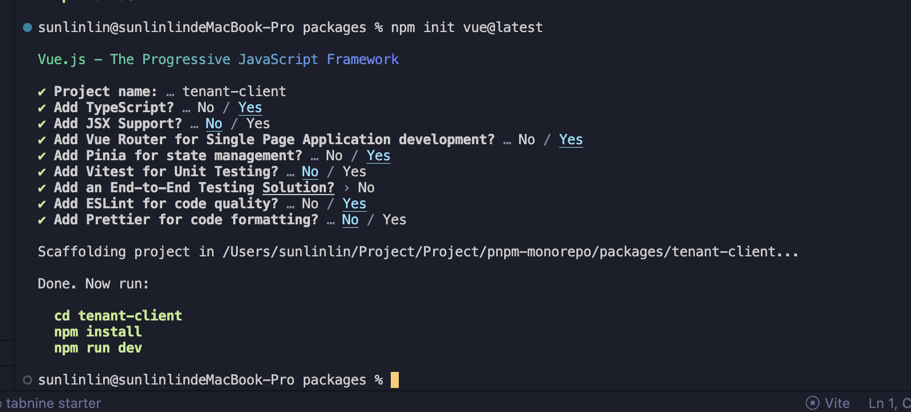

# Monorepo

* 模版地址： https://gitee.com/ll3462540450/monorepo
## 什么是Monorepo ?
>Monorepo可以理解为一种基于仓库的代码管理策略，它提出将多个代码工程“独立”的放在一个仓库里的管理模式。每个代码工程在逻辑上是可以独立运行开发以及维护管理的。Monorepo 在实际场景中的运用可以非常宽泛，甚至有企业将它所有业务和不同方向语言的代码放在同一个仓库中管理。

* pnpm的`Monorepo` 的意思是在版本控制系统的单个代码库里包含了许多项目的代码。这些项目虽然有可能是相关的，但通常在逻辑上是独立的，并由不同的团队维护。
* pnpm 跟 npm、yarn 一样，也内置了对 monorepo 的支持，使用起来比较简单，在项目根目录中新建 pnpm-workspace.yaml 文件，并声明对应的工作区就可以了。
## `Monorepo` 好处
  * 规范、工作流的统一性
  * 代码复用和版本依（多个项目公共部分可以统一提取到 `packages` 下 例如 `packages/shared`）
  * 团队协作以及权限控制 根据`Monorepo`的特点，各个`packages`之间相对独立的
 * 性能优化: 
  * 源码体积优化 （移除冷门的API 引入tree-shaking）
  * 数据劫持优化
  * 编译优化

> 整体是通过 `monorepo` 方式进行管理并根据功能的不同在 `packages` 目录下进行划分不同的模块目录。我们可以看到每一个目录下面都一个 `package.json` 文件，代表每一个目录都是一个 npm 包，每个包有各自的 API、类型定义和测试模块以及 Readme 文档。这样就可以将模块拆分得更细的颗粒度，职责划分也更明确。
## Vue3 组件库 monorepo 环境搭建
monorepo 的好处就是可以在一个代码仓库中管理多个项目，可以达到项目之间的资源共享
Element Plus 最新是采用 pnpm 方式来进行 monorepo 环境搭建。pnpm 的特点，主要就是速度快，还有就是磁盘利用率高，而且使用这个 pnpm 来搭建的 monorepo 环境，是非常容易的。通过 pnpm 我们可以快速的去搭建出一个 monorepo 环境。

## 首先进行全局安装 pnpm
```js
npm install pnpm -g
```
## 初始化
然后在项目下使用 pnpm init 进行 package.json 的初始化。这跟 npm init 是一样的
```js
pnpm init
```
* 得到 package.json 初始内容，然后把 package.json 中的 name 属性删掉，并且添加一个 "private": true 属性，因为它是不需要发布的。
```js
{
  "private": true,
  "version": "1.0.0",
  "description": "",
  "main": "index.js",
  "scripts": {
    "test": "echo \"Error: no test specified\" && exit 1"
  },
  "keywords": [],
  "author": "",
  "license": "ISC"
}

```
## 配置 pnpm 的 monorepo 工作区

 在我们这个仓库下，我们需要管理多个项目，就可以采用 pnpm 的 monorepo。我们在仓库的根目录下创建一个 pnpm-workspace.yaml 文件，可以在 pnpm-workspace.yaml 配置文件中指定这个仓库中有多少个项目。
 ```js
 packages:
  - play # 存放组件测试的代码
  - docs # 存放组件文档
  - packages/* # packages 目录下都是组件包
 ```
 可以在 play 目录中运行我们写好的组件，相当于一个测试环境，在开发的时候可以知道效果是否达到预期；还需要一个组件说明文档的项目目录：docs; packages 目录则是所有组件的项目目录了，在 packages 目录中又可以放很多包的项目目录，比如，组件包目录：components、主题包目录：theme-chalk、工具包目录：utils 等。然后每一个包目录里面也需要一个 package.json 文件进行声明这是一个 NPM 包目录。所以我们需要进入每个包目录进行初始一个 package.json 文件。
## 新建packages
* npm init vue@latest


## 如何设计公共文件
* 根目录 `npm init @vue/latest ` 会生成vue模版,将没用的东西删掉，比如 （index.html, public）
* 每一个模版中都会生成一个  `package.json`
```js
{
  "name": "@conferer/components", // 模版名称
  "version": "0.0.1", // 版本号
  "main": "index.ts", //入口文件
}
```
* 新建 入口文件 index.ts
* 将组件抛出
```js
import CBtn from './src/components/CButton.vue'
export { CBtn }
```

## 如何使用components
* 我们应该如何使用公共的文件呢？
* 举个例子我们可以进入到 `packages/h5-client ` 文件夹中执行  `pnpm add @conferer/components` package.json 中 `"dependencies"`
* 会生成`"@conferer/components": "workspace:^0.0.1"`

* 引用组件
```js
import { CBtn } from "@conferer/components";
<CBtn msg="引用全局组件" @click="$emit('click', 'hi~')"/>
```
* 安装依赖
```js
pnpm install '依赖' @panda/web
```
## 仓库项目内的包相互调用
```js
pnpm add @conferer/components
```
```js
├── README.md
├── package.json
├── packages
│   ├── components
│   │   └── package.json
│   ├── theme-chalk
│   │   └── package.json
│   └── utils
│       └── package.json
├── play
└── pnpm-workspace.yaml
```