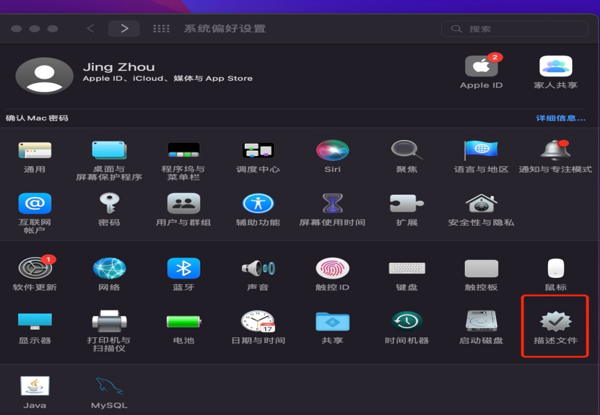
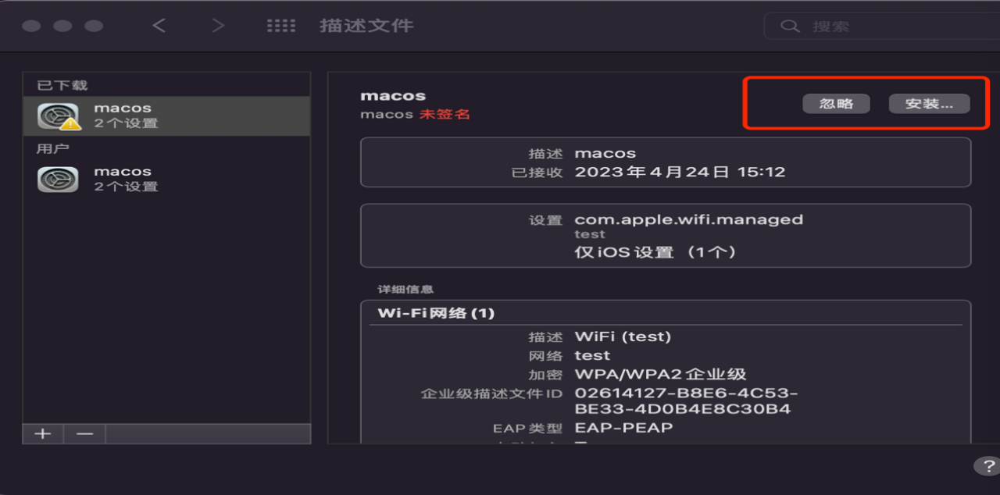
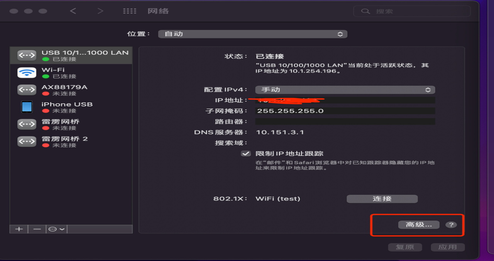
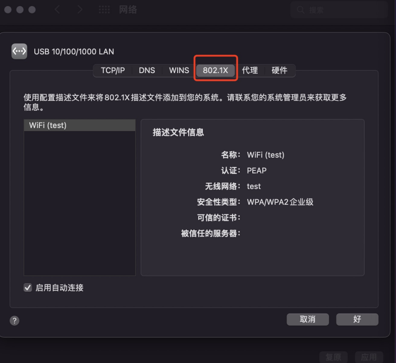
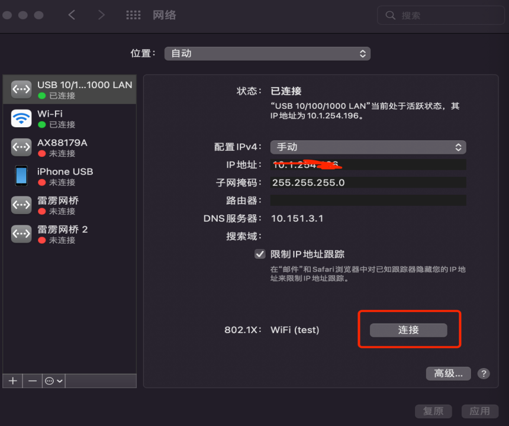
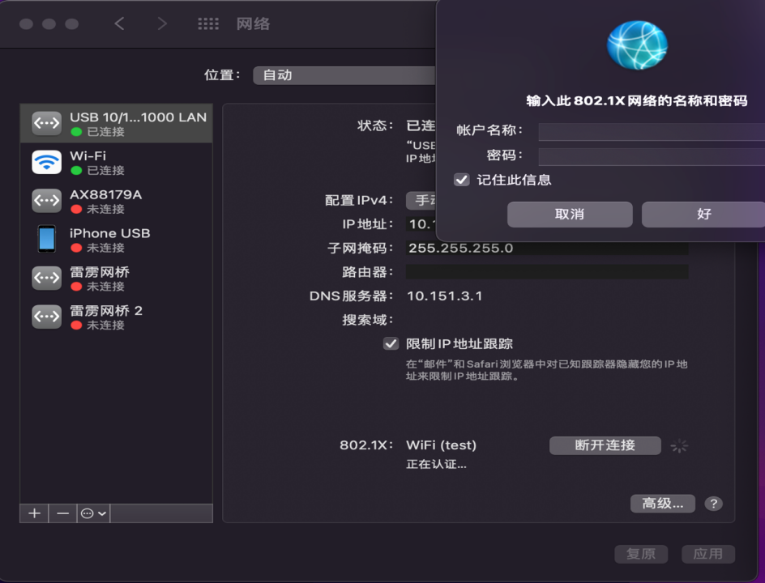
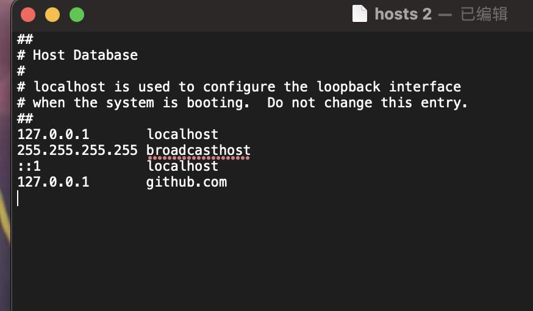

## 客户端配置
* MAC安装描述文件
双击macos.mobileconfig文件，打开系统偏好设置，点击描述文件，点击安装



* MACOS自带客户端接入认证
* 打开偏好设置——>网络，选择有线网卡，右下角点击高级,
* 802.1x勾选“启用自动连接”。确定后，自动弹框输入用户名和密码，点击认证，认证成功后入网。账号是申请的员工号，密码为asgt,admin.123


* 路由器要填写10.1.253.254


802.1x 网络的用户名和密码
* 18842323905
* asgt,admin.123


## macos.mobileconfig 文件
```js
<?xml version="1.0" encoding="UTF-8"?>
<!DOCTYPE plist PUBLIC "-//Apple//DTD PLIST 1.0//EN" "http://www.apple.com/DTDs/PropertyList-1.0.dtd">
<plist version="1.0">
<dict>
	<key>PayloadContent</key>
	<array>
		<dict>
			<key>AutoJoin</key>
			<true/>
			<key>EAPClientConfiguration</key>
			<dict>
				<key>AcceptEAPTypes</key>
				<array>
					<integer>25</integer>
				</array>
				<key>EAPFASTProvisionPAC</key>
				<false/>
				<key>EAPFASTProvisionPACAnonymously</key>
				<false/>
				<key>EAPFASTUsePAC</key>
				<false/>
				<key>UserName</key>
				<string>huanglei</string>
				<key>UserPassword</key>
				<string>1</string>
			</dict>
			<key>EncryptionType</key>
			<string>WPA</string>
			<key>HIDDEN_NETWORK</key>
			<false/>
			<key>Password</key>
			<string>123</string>
			<key>PayloadDescription</key>
			<string>Configures wireless connectivity settings.</string>
			<key>PayloadDisplayName</key>
			<string>WiFi (test)</string>
			<key>PayloadIdentifier</key>
			<string>test.wifi1</string>
			<key>PayloadOrganization</key>
			<string>macos</string>
			<key>PayloadType</key>
			<string>com.apple.wifi.managed</string>
			<key>PayloadUUID</key>
			<string>B756E8FB-40DD-4DE7-90EC-30CEEFA78649</string>
			<key>PayloadVersion</key>
			<integer>1</integer>
			<key>ProxyType</key>
			<string>None</string>
			<key>SSID_STR</key>
			<string>test</string>
		</dict>
		<dict>
			<key>Host</key>
			<string></string>
			<key>MailNumberOfPastDaysToSync</key>
			<integer>0</integer>
			<key>PayloadDescription</key>
			<string>Configures device for use with Microsoft Exchange ActiveSync services.</string>
			<key>PayloadDisplayName</key>
			<string>Exchange ActiveSync</string>
			<key>PayloadIdentifier</key>
			<string>test.eas2</string>
			<key>PayloadOrganization</key>
			<string>macos</string>
			<key>PayloadType</key>
			<string>com.apple.eas.account</string>
			<key>PayloadUUID</key>
			<string>EB76F587-0C9A-45AE-8F86-8E72F3E999E6</string>
			<key>PayloadVersion</key>
			<integer>1</integer>
			<key>PreventAppSheet</key>
			<false/>
			<key>PreventMove</key>
			<false/>
			<key>SMIMEEnabled</key>
			<false/>
			<key>SSL</key>
			<true/>
			<key>disableMailRecentsSyncing</key>
			<false/>
		</dict>
	</array>
	<key>PayloadDescription</key>
	<string>macos</string>
	<key>PayloadDisplayName</key>
	<string>macos</string>
	<key>PayloadIdentifier</key>
	<string>test</string>
	<key>PayloadOrganization</key>
	<string>macos</string>
	<key>PayloadRemovalDisallowed</key>
	<false/>
	<key>PayloadType</key>
	<string>Configuration</string>
	<key>PayloadUUID</key>
	<string>32C472AD-D872-4FB8-B5D8-423E96A41CD4</string>
	<key>PayloadVersion</key>
	<integer>1</integer>
</dict>
</plist>

```

## route 命令填写路由表
```js
sudo route  -n add -net 192.1.0.0  -netmask  255.255.0.0  内网ip
sudo route  -n add -net 192.2.0.0  -netmask  255.255.0.0  内网ip
sudo route  -n add -net 192.168.0.0  -netmask  255.255.0.0 内网ip
sudo route  -n add -net 10.0.0.0 -netmask  255.0.0.0 内网ip
sudo route -n add -net 172.20.0.0 -netmask 255.255.0.0 内网ip
```

## Hosts文件修改
[Mac OS 下三种修改Hosts文件的方法](https://www.jianshu.com/p/752211238c1b)。
* 可以把内网的 ip 对应的域名写在下面，保存即可

