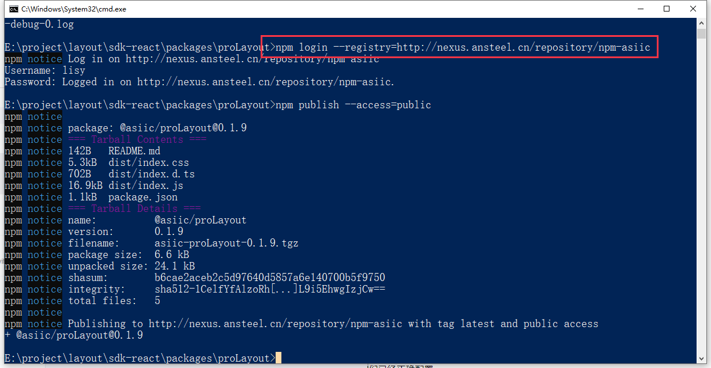
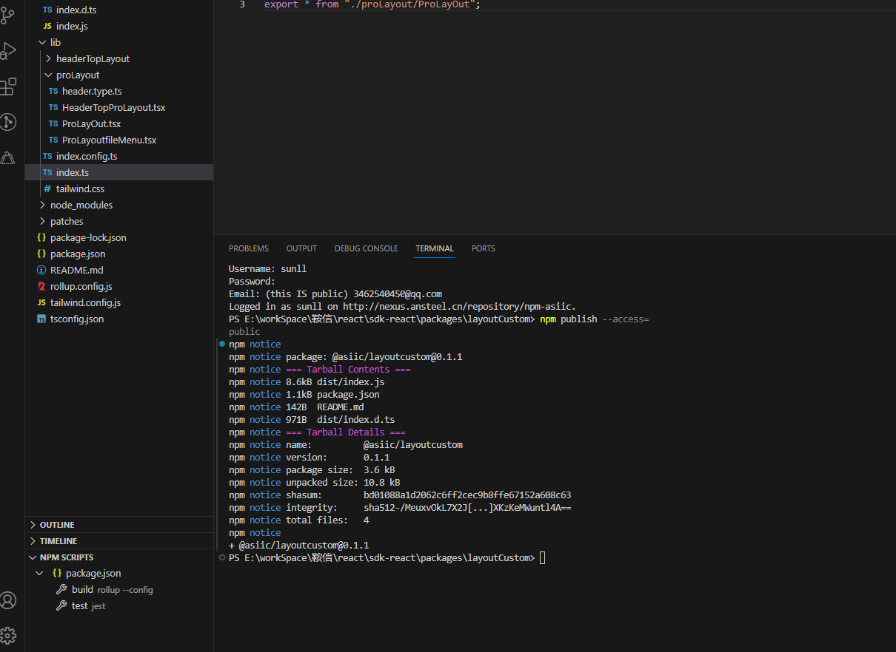

# NPM
查看npm 依赖包所以版本
```js
npm view <package-name> versions
```
## nexus

* 改package.json的版本号
* 执行npm run build ，打出dist文件



## Tailwind-scrollbar

滚动条添加样式 -> https://www.npmjs.com/package/tailwind-scrollbar

## Driver 页面分步引导

安装

```js
npm i driver.js
```

引导节点

```html
<span id="intro_title" />
<span id="intro_mine" />
<div id="intro_save" />
```

新建 steps.js

```js
export default [
  {
    element: "#intro_title",
    popover: {
      title: "这是本站首页",
      description: "本站首页是一些展示性的信息",
      position: "bottom",
    },
  },
  {
    element: "#intro_mine",
    popover: {
      title: "这是帮助",
      description: "点此处可获取一些本站的相关说明",
      position: "bottom",
    },
  },
  {
    element: "#intro_save",
    popover: {
      title: "联系我们",
      description: "点击这里可获取我们的相关信息",
      position: "bottom",
    },
  },
];
```

```js
引入;
import Driver from "driver.js"; // 页面引导操作
import "driver.js/dist/driver.min.css";
import steps from "./steps.js";

onMounted(() => {
  showTips();
});
function showTips() {
  const driver = new Driver({
    prevBtnText: "上一步",
    nextBtnText: "下一步",
    doneBtnText: "我知道了",
    closeBtnText: "关闭",
  });
  // 将引入的步骤节点放到 driver中
  driver.defineSteps(steps);
  driver.start();
}
```

```css
.driver-fix-stacking {
  position: relative;
}
```

## Gsap 动画库

```html
<!-- 大图详情处理 -->
<transition
  :css="false"
  @before-enter="beforeEnter"
  @enter="enter"
  @leave="leave"
>
  <pins-vue v-if="isVisiblePins" :id="currentPins.id" />
</transition>
```

```js
/**
 * 进入动画开始前
 */
const beforeEnter = (el) => {
  gsap.set(el, {
    scaleX: 0,
    scaleY: 0,
    transformOrigin: "0 0",
    translateX: currentPins.value.localtion?.translateX,
    translateY: currentPins.value.localtion?.translateY,
    opacity: 0,
  });
};
/**
 * 进入动画执行中
 */
const enter = (el, done) => {
  gsap.to(el, {
    duration: 0.3,
    scaleX: 1,
    scaleY: 1,
    opacity: 1,
    translateX: 0,
    translateY: 0,
    onComplete: done,
  });
};
/**
 * 离开动画执行中
 */
const leave = (el, done) => {
  gsap.to(el, {
    duration: 0.3,
    scaleX: 0,
    scaleY: 0,
    x: currentPins.value.localtion?.translateX,
    y: currentPins.value.localtion?.translateY,
    opacity: 0,
  });
};
```
