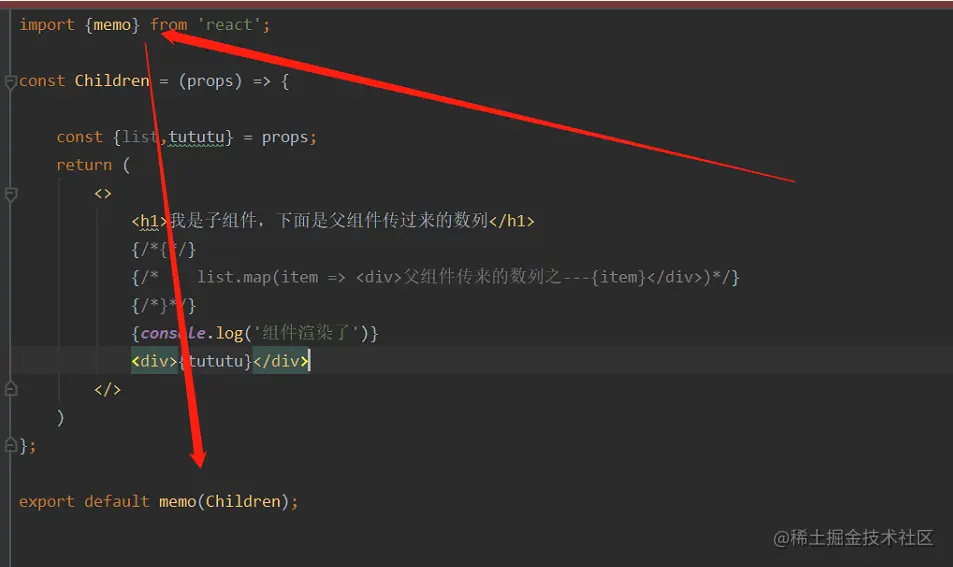

## memo 的作用

- memo 是 react 的一种`缓存技术`，这个函数可以检测从父组件接收的 props,并且在父组件改变 state 的时候比对这个 state 是否是本组件在使用，如果不是，则拒绝重新渲染。

### 使用方式


像这样，这 Children 就是被缓存成功了。下次当父组件中无关它的 state（状态）被更新时候，Children 组件就不会重新渲染。
::: tip
当前组件被 memo 保护，那么当前组件的 props 不变，则组件不进行重新渲染。这样，我们合理的使用 memo 就可以为我们的项目带来很大的性能优化
:::

### 第一个坑

有那么一种情况，当被改变的那个 props 是一个数组（对象）的时候，被 memo 的保护的组件即使 props 变了，它也不会重新渲染

- 例如
  传入了一个 list 数组进去子组件，子组件内部是被 memo 缓存了的。这个时候，如果我们往 list 这个数组中 push()一个 6，那么子组件中的 props 改变了，理论上来说，子组件应该重新渲染了。但
  实际上并不会。

这是为什么呢？因为 memo 的保护是对 props 做一个浅比较

而数组的使用`push()方法`看似是变了。但变的只是堆中的数据，存在与栈中的地址依然不会改变。`memo是检测不到的`。所以，使用 push 等不能返回一个新数组的方法，均无法触发 memo 的更新机制。

- 解决方法 需要让memo检测到数组栈地址的变化。要栈地址变化的话，只要返回一个全新的数组就好了。

```js
const [list, setList] = useState([1, 2, 3, 4, 5]);

setList(list.push(1)); //这样是不会被memo检测到的，是无法触发memo更新的

setList([...list, 1]); //这样才可以，创建一个新数组，再在里面解构旧数组，往后面追加 1
//这样,就等于返回了一个新的数组，栈中的地址就会改变，memo就可以检测到并触发更新
```
### 第二个坑
我们需要知道的是，`缓存也需要成本`。如果每个组件都进行缓存，会给浏览器带来非常非常大的负担。

`所以在平常项目中，我们需要挑选一些经常被使用，经常会被重新渲染的组件去有目标的缓存他。而不是每一个组件都缓存一下。`
::: tip
* 父组件中state（状态）改变，不受memo保护的子组件也会重新渲染
* memo会检测props到改变来决定组件是否需要进行重新渲染，换言之就是，被memo函数包起来的组件只有本身的props被改变之后才会重新渲染
* memo只能进行浅拷贝来校验决定是否触发重新渲染。所以改变数组（对象）的props时候记得返回一个全新的数组（对象）
* memo不是项目中所有的组件都需要包一下。包的太多反而会起反效果，我们需要选择那些经常被重新渲染的组件有选择性的去缓存。
:::