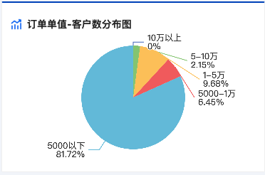
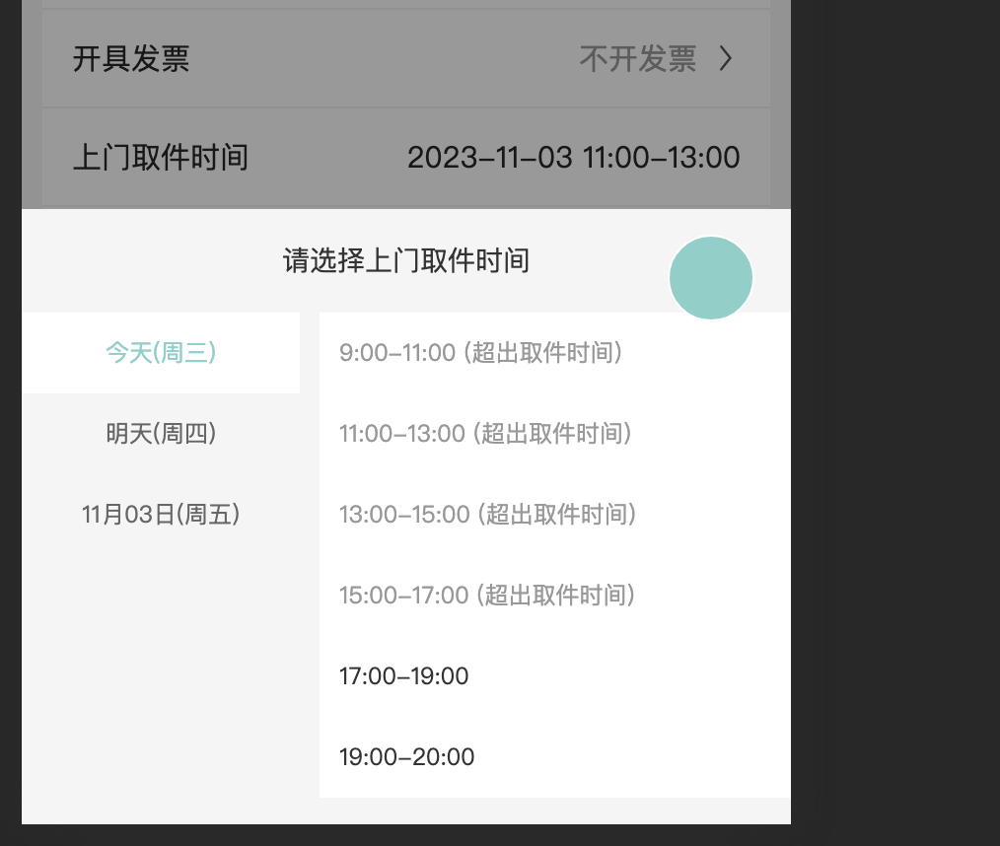
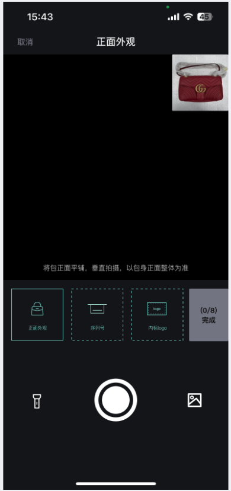
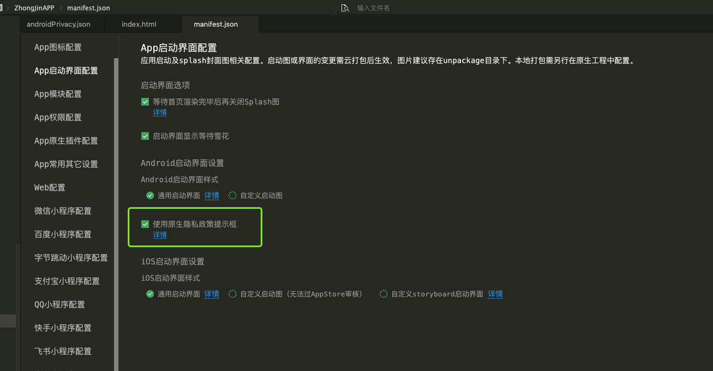

* `https://github.com/8Little-fox/uniapp-template`
## echarts

方案一： 插件市场 秋云（ucharts）
方案二： 导入 echarts https://echarts.apache.org/zh/index.html

```html
<script>
  <view
    id="echarts"
    :prop="option"
    :change:prop="echarts.updateEcharts"
    class="echarts"
    style="width: 100%;height:350rpx"
    @click="echarts.onClick"
  />
  export default {
    data() {
      return {
        option: {
          tooltip: {
            trigger: "item",
          },
          legend: {
            show: false,
            orient: "vertical",
            left: "left",
          },
          series: [
            {
              type: "pie",
              radius: "80%",
              data: [],
              emphasis: {
                itemStyle: {
                  shadowBlur: 10,
                  shadowOffsetX: 0,
                  shadowColor: "rgba(0, 0, 0, 0.5)",
                },
              },
            },
          ],
        },
      };
    },
    methods: {
      getAPiData() {
        // 请求数据，图表赋值
        this.option.series[0].data = res.map((item) => ({
          value: item.num,
          name: item.name + '\n' + this.toPercent(res, item.num),
        }))
      },
      // 计算百分比
      toPercent(res, num) {
        const sum = res.reduce((prev, next) => {
          return prev + next.num
        }, 0)
        return Math.round((num / sum) * 10000) / 100.0 + '%' // 小数点后两位百分比
      },
      onViewClick(options) {
        console.log(options)
      },
    }
  };
</script>
```
* echarts官网在线定制下载后的包，存放到 根目录`static/echarts.js` 
```js
<script module="echarts" lang="renderjs">
	let myChart
	export default {
		mounted() {
			if (typeof window.echarts === 'function') {
				this.initEcharts()
			} else {
				// 动态引入较大类库避免影响页面展示
				const script = document.createElement('script')
				// view 层的页面运行在 www 根目录，其相对路径相对于 www 计算
				script.src = 'static/echarts.js'
				script.onload = this.initEcharts.bind(this)
				document.head.appendChild(script)
			}
		},
		methods: {
			initEcharts() {
				myChart = echarts.init(document.getElementById('echarts'))
				// 观测更新的数据在 view 层可以直接访问到
				myChart.setOption(this.option)
			},
			updateEcharts(newValue, oldValue, ownerInstance, instance) {
				// 监听 service 层数据变更
				myChart.setOption(newValue)
			},
			onClick(event, ownerInstance) {
				// 调用 service 层的方法
				ownerInstance.callMethod('onViewClick', {
					test: 'test'
				})
			}
		}
	}
</script>
```

## 上门取件时间
* @/components/TimeSelect



## 拍摄
* @/components/gg-camera/gg-camera.vue



## 导入特殊字体
```html
<view class="font">
  特殊字体
</view>
<style scoped lang="scss">
@font-face {
  font-family: 'siyuan';
  src: url("@/static/iconfont/font.ttf"); //字体包路径
}
.font {
   font-family: siyuan;
}
</style>
```
## APP 消息推送

APP.vue

```js
    onLaunch: function() {
      // #ifdef APP-PLUS
      if (uni.getSystemInfoSync().platform == 'android') {
        let main = plus.android.runtimeMainActivity()
        // 为了防止快速点按返回键导致程序退出重写quit方法改为隐藏至后台
        plus.runtime.quit = function() {
          main.moveTaskToBack(false)
        }
        // 重写toast方法如果内容为 ‘再次返回退出应用’ 就隐藏应用，其他正常toast
        plus.nativeUI.toast = function(str) {
          if (str == '再次返回退出应用') {
            plus.runtime.quit()
          } else {
            str = str == '再按一次退出应用' ? '再次返回应用后台运行' : str
            uni.showToast({
              title: str,
              icon: 'none',
            })
          }
        }
      }
      const clientInfo = plus.push.getClientInfo()
      setTimeout(() => {
        uni.setStorageSync('cid', clientInfo.clientid)
      }, 1500)
      // 获取推送信息
      plus.push.addEventListener(
        'receive',
        function(msg) {
          console.log('(receive):' + JSON.stringify(msg))
          var client = uni.getSystemInfoSync().platform
          // 增加非空判断  否则ios闪退
          if (msg.content != null && msg.content != '') {
            if (client == 'android') {
              // 如果是Android，当APP在线时，收到透传消息不会进入系统消息，需要发送本地提醒。
              plus.push.createMessage(msg.title, msg.payload, JSON.parse(JSON.stringify(options)))
            }
            if (client == 'ios') {
              // 如果是IOS
              // var payload = msg.payload;
              // 【APP离线】收到消息，但没有提醒（发生在一次收到多个离线消息时，只有一个有提醒，但其他的没有提醒）
              // 【APP在线】收到消息，不会触发系统消息,需要创建本地消息，但不能重复创建。必须加msg.type验证去除死循环
              if (msg.aps == null && msg.type == 'receive') {
                var messageTitle = msg.title
                var messageContent = msg.content
                console.log(messageTitle)
                console.log(messageContent)
                // 创建本地消息,发送的本地消息也会被receive方法接收到，但没有type属性，且aps是null
                plus.push.createMessage(messageContent, JSON.stringify(msg), {
                  title: messageTitle,
                })
              }
            }
          }
        },
        false
      )
      // 点击消息时
      plus.push.addEventListener(
        'click',
        function(msg) {
          var client = uni.getSystemInfoSync().platform
          console.log('(click)*********:' + JSON.stringify(msg))
          if (client == 'ios') {
            // 如果是IOS
            var payload
            if (msg.type == 'click') {
              // APP离线点击包含click属性，这时payload是JSON对象
              payload = msg.payload
            } else {
              // APP在线，收到消息不会包含type属性,这时的payload是JSON字符串，需要转为JSON对象
              const params = JSON.parse(msg.payload)
              payload = params.payload
            }
            console.log('payload*******', payload)
            if (payload != null || payload != undefined) {
              if (payload.type === 172) {
                uni.navigateTo({
                  url: `/pages_log/detail?id=${payload.typeId}`,
                })
              }
            }
          }
          if (client == 'android') {
            // 如果是Android，收到playload均是是JSON字符串，需要转为JSON对象
            var payload = msg.payload
            console.log('msg.payload:' + msg.payload)
            if (payload != null || payload != undefined) {
              console.log('payload:' + payload)
              plus.runtime.setBadgeNumber(0) // 清除app角标
              if (msg.payload.type === 172) {
                uni.navigateTo({
                  url: `/pages_log/detail?id=${msg.payload.typeId}`,
                })
              }
            }
          }
        },
        false
      )
      // #endif
      this.initApp()
    }
```
## uuid 获取
* ios:无法安装此app，因为无法验证其完整性
* 需要将该设备的uuid 加入

`https://www.pgyer.com/tools/udid`

`https://blog.csdn.net/qq_35261510/article/details/86677060`

## ios 页面回弹

如果出现此现象解决方案有以下几种

- 元素的外层盒子 设置宽度 750rpx box-sizing: border-box
- 该页面的 组件内，或许会存在元素超出的情况，采用以上方案即可

# uniapp

## 瞄点

```js
const query = uni.createSelectorQuery().in(this);
query
  .select("#id")
  .boundingClientRect((data) => {
    uni.pageScrollTo({
      scrollTop: data.top,
    });
  })
  .exec();
```

## Tabs

动态菜单切换

```js
   <scroll-view
      scroll-x="true"
      scroll-with-animation
      :scroll-left="tabLeft"
      show-scrollbar="true"
      class="order-tab"
    >
      <view>
        <view
          class="longItem"
          :style="'width:' + isWidth + 'px'"
          :class="index === tabClick ? 'click' : ''"
          v-for="(item, index) in ORDER_LIST"
          :key="index"
          @click="longClick(index)"
        >
          <view class="acea-row row-middle row-center">
            <view> {{ item.title }}</view>
            <view v-if="item.icon" class="iconfont icon-shaixuan"></view>
          </view>
        </view>
      </view>
    </scroll-view>

  export const ORDER_LIST = [
  { title: "全部订单", icon: false },
  { title: "待审核", icon: false },
  { title: "待发货", icon: false },
  { title: "待签收", icon: false },
  { title: "筛选", icon: true },
];
  data () {
    isWidth: 0, //每个导航栏占位
    tabClick: 0, //导航栏被点击
    tabLeft: 0,
  }
  methods: {
    longClick(index) {
      if (this.ORDER_LIST.length > 5) {
        this.tabLeft = (index - 1) * (this.isWidth + 6); //设置下划线位置
      }
      this.tabClick = index; //设置导航点击了哪一个
    },
  }
```

```css
.longItem {
  display: inline-block;
  text-align: center;
  font-size: 28rpx;
  font-family: PingFang SC-Medium, PingFang SC;
  font-weight: 500;
  color: #323233;
  overflow: hidden;
  text-overflow: ellipsis;
  white-space: nowrap;
  line-height: 82rpx;
  border-bottom: 6rpx solid transparent;
  .icon-shaixuan {
    font-size: 32rpx;
  }
  &.click {
    border-bottom: 6rpx solid #1574ff;
  }
}
```

## navbar

```js
<template>
	<view class="">
		<!-- #ifdef MP || APP-PLUS -->
		<view class="sys-head">
			<view class="sys-bar" :style="{height:sysHeight}"></view>
			<!-- #ifdef MP -->
			<view class="title-box" >
				<view class="arrow-left" v-if="backShow">
					<u-icon bold name="arrow-left" size="18" color="#333" hover-class="none" @click="goBack"></u-icon>
				</view>
				<view class="" style="width: 60rpx;" v-if="!backShow"></view>
				<view class="sys-title" :style="{color: titleColor}">{{title}}</view>
			</view>
			<!-- #endif -->
			<!-- <view class="bg"></view> -->
		</view>
		<!-- #endif -->
	</view>
</template>

<script>
	let sysHeight = uni.getSystemInfoSync().statusBarHeight + 'px';
	export default {
		data() {
			return {
				sysHeight: sysHeight,
			}
		},
		props: {
			// 标题
			title: {
			    type: String,
			    default: ''
			},
			// 标题颜色
			titleColor: {
				type: String,
				default: ''
			},
			// 返回键
			backShow:{
				type: Boolean,
				default: false
			}
		},
		components: {},
		onLoad() {

		},
		methods: {
			goBack(){
				uni.navigateBack()
			},
		}
	}
</script>

<style lang="scss">

	.sys-head {
	  position: relative;
	  width: 100%;
	}
	.title-box{
		display: flex;
		align-items: center;
	}
	.arrow-left{
		padding-left: 28rpx;
		// width: 60rpx;
		// text-align: end;
		// padding-left: 28rpx;
	}
	.sys-title{
		flex: 1;
		z-index: 10;
		position: relative;
		height: 43px;
		text-align: center;
		margin-right: 70rpx;
		line-height: 43px;
		font-size: 28rpx;
		color: #FFFFFF;
	}
</style>
```

## uView picker 第二次才能选中 延迟导致选中问题

`immediateChange`:是否在手指松开时立即触发 change 事件。若不开启则会在滚动动画结束后触发 change 事件，只在微信 2.21.1 及以上有效

```js
immediateChange设置为true
<u-picker :show="showPicker" :columns="columns" @cancel='showPicker = false' @confirm="confirm" :immediateChange ='true'></u-picker>
```

## input 小数点键盘 type="digit"

```js
<input type="digit" placeholder="请输入" />
```

## 解决应用市场检测到弹出隐私政策提示框之前读取 mac 地址和应用列表的问题

```js androidPrivacy.json
{
    "version" : "1",
    "prompt" : "template",
    "title" : "服务协议和隐私政策",
    "message" : "　　请你务必审慎阅读、充分理解“服务协议”和“隐私政策”各条款，包括但不限于：为了更好的向你提供服务，我们需要收集你的设备标识、操作日志等信息用于分析、优化应用性能。<br/>　　你可阅读<a href=\"https://zjzzstaff.zhongjinzz.com/upload/yonghufuwuxieyi.html\">《服务协议》</a>和<a href=\"https://zjzzstaff.zhongjinzz.com/upload/yinsizhengce.html\">《隐私政策》</a>了解详细信息。如果你同意，请点击下面按钮开始接受我们的服务。",
    "buttonAccept" : "同意并接受",
    "buttonRefuse" : "拒绝",
    "second" : {
        "title" : "确认提示",
        "message" : "　　进入应用前，你需先同意<a href=\"https://zjzzstaff.zhongjinzz.com/upload/yonghufuwuxieyi.html\">《服务协议》</a>和<a href=\"https://zjzzstaff.zhongjinzz.com/upload/yinsizhengce.html\">《隐私政策》</a>，否则将退出应用。",
        "buttonAccept" : "同意并继续",
        "buttonRefuse" : "拒绝并退出应用"
    },
    "styles" : {
        "backgroundColor" : "#fff",
        "borderRadius" : "5px",
        "title" : {
            "color" : "#000"
        },
        "buttonAccept" : {
            "color" : "#333"
        },
        "buttonRefuse" : {
            "color" : "#bfbfbf"
        }
    }
}
```



# 文件预览（pdf,图片）

```js
	<view class="files__name" @click="filePreview(item)">点击预览</view>
  filePreview(file) {
    wx.downloadFile({
      url: file.url, //仅为测试接口，并非真实的
      success: function(res) {
        const fileType = file.url.split('.').pop()
        var filePath = res.tempFilePath
        console.log(fileType);
        if(fileType === 'jpg' || fileType === 'png' || fileType === 'jpeg'){
          wx.previewImage({
            current: res.tempFilePaths, // 当前显示图片的http链接
            urls: [file.url] // 需要预览的图片http链接列表
          })
          return
        }
        uni.openDocument({
          filePath: filePath,
          fileType: fileType,
          success: function(res) {
            console.log(res);
          },
          fail: function(res) {
          },
          complete(res) {
            console.log(res);
          }
        });
      },
      fail: function(res) {
        console.log('fail')
        console.log(res)
      },
      complete: function(res) {
        console.log('complete')
        console.log(res)
      }
    })
  }
```
