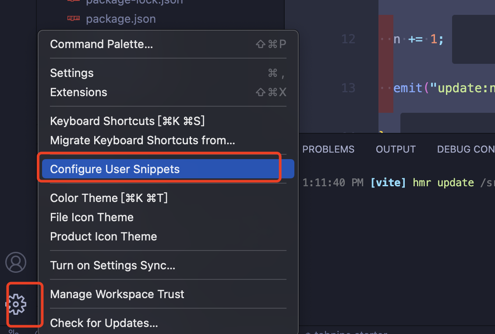
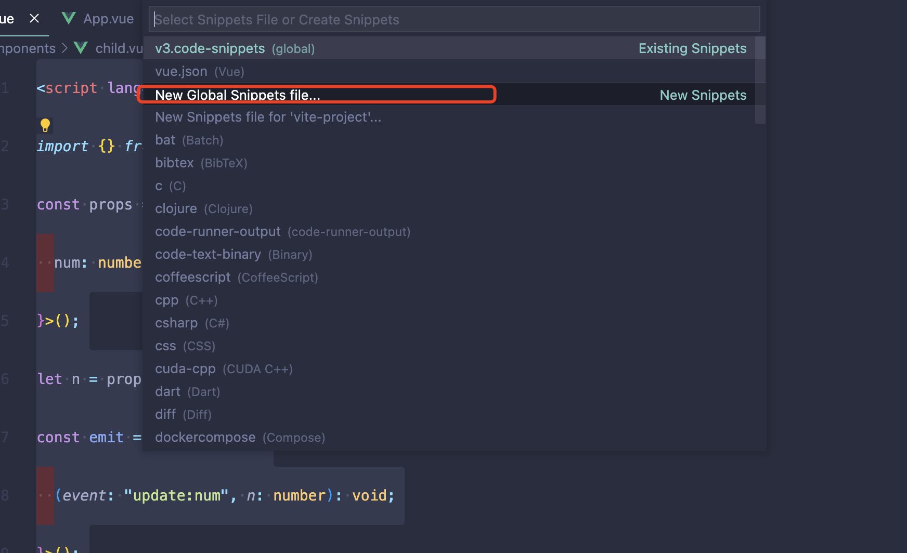
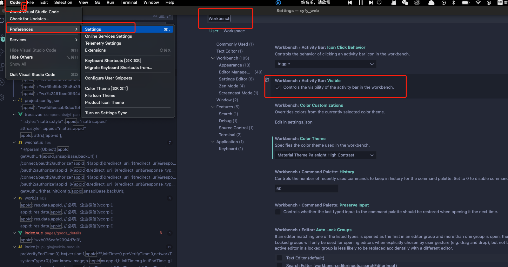

## 快速搭建 vue 模版



v3.code-snippets
```js
{
  "demo": {
    "prefix": "v3",
    "body": [
      "<script lang='ts' setup>",
      "import {  } from 'vue'",
      "\t\t$0",
      "</script>",
      "",
      "<template>",
      "\t",
      "</template>",
      "",
      "<style lang='scss' scoped>",
      "\t",
      "</style>"
    ],
    "description": "自定义的一个vue3模板"
  }
}
```
输入 `v3` 生成下面这种效果👇
```js
<script lang='ts' setup>
import {  } from 'vue'
    
</script>

<template>
  
</template>

<style lang='scss' scoped>
  
</style>
```

## 侧边栏设置


## CodeGeeX智能编程助手
`https://codegeex.cn/`
代码注释功能很棒