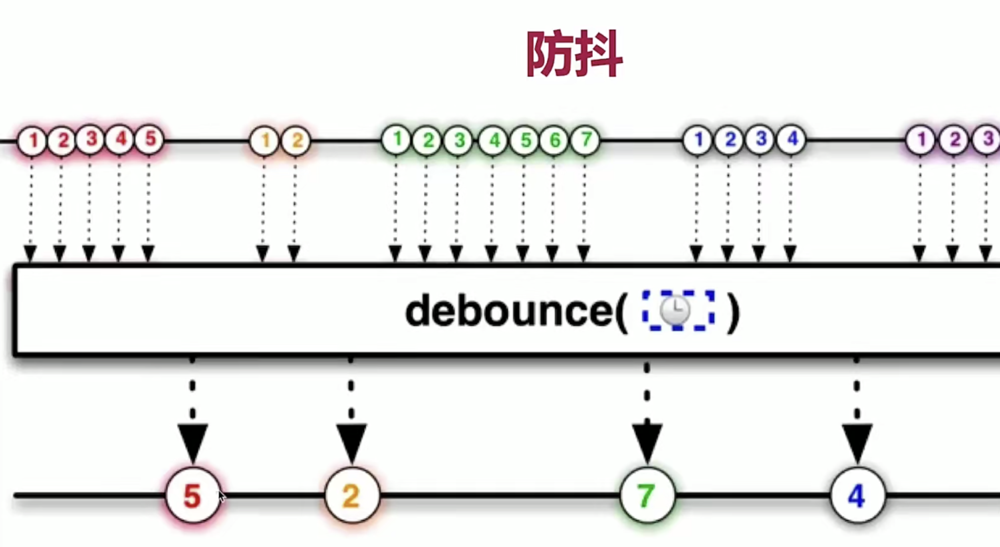
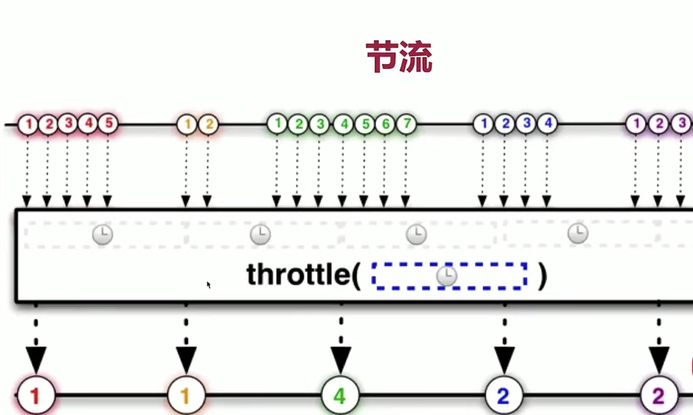

# 前端面试题

## MVVM
* MVVM是`Model-View-ViewModel` 缩写，Model层代表数据模型，View代表UI组件， ViewModel是View 和Model 的桥梁，数据会绑定到ViewModel层并自动将数据渲染到页面中，视图变化的时候会通知viewMode层更新数据

## vue2.x 响应式原理
* 当创建 Vue 实例时,vue 会遍历 data 选项的属性,利用 Object.defineProperty 为属性添加 getter 和 setter 对数据的读取进行劫持（getter 用来依赖收集,setter 用来派发更新）,并且在内部追踪依赖,在属性被访问和修改时通知变化

## v-if和v-for哪个优先级更高
* v-for 优先于v-if 被解析 先执行循环在判断条件
* 通常有两种情况下导致我们这样做：

`v-if` 与 `v-show` 都能控制dom元素在页面的显示

`v-if `相比 `v-show` 开销更大的（直接操作dom节点增加与删除）

如果需要非常频繁地切换，则使用 `v-show` 较好

如果在运行时条件很少改变，则使用 `v-if` 较好
## 原型和原型链
原型： 显式原型 和 隐式原型
`student.__proto__. === Student.prototype`
对象的隐式原型 等于 类的显式原型
`hasOwnProerty()`判断是否是对象本身的属性或方法

## 闭包
一个函数和它的周围的状态的引用捆绑在一起的组合
1: 函数里面返回函数
2: 函数作为参数

## Vue 中如何扩展一个组件
1: 逻辑扩展： mixins , extends, composition api 
2: 内容扩展： slots
## 组件中的data 为什么是一个函数？
*  一个组件被复用多次的话，会创建多个实例，为了保证组件不同的实例之间data不冲突，data 必须是一个函数
## SPA 单页面应用都有什么优缺点呢？

* 优点：
	用户体验好，数据渲染快
	对服务器压力小（前后端分离）

* 缺点：
	初次加载耗时多，SEO难度较大（所有的内容都在一个页面中动态替换显示）

## SPA首屏加载速度慢的怎么解决？
  ### 加载慢的原因
  在页面渲染的过程，导致加载速度慢的因素可能如下：
  * 网络延时问题
  * 资源文件体积是否过大
  * 资源是否重复发送请求去加载了
  * 加载脚本的时候，渲染内容堵塞了
  ### 解决方案
  常见的几种SPA首屏优化方式
  * 减小入口文件积
  * 静态资源本地缓存
  * UI框架按需加载
  * 图片资源的压缩
  * 组件重复打包
  * 开启GZip压缩
  * 使用SSR

  #### 减小入口文件积
  1: 路由懒加载，把不同路由对应的组件分割成不同的代码块，待路由被请求的时候会单独打包路由，使得入口文件变小，加载速度大大增加

  2: 在vue-router配置路由的时候，采用动态加载路由的形式
  ```js
  routes:[ 
    path: 'Blogs',
    name: 'ShowBlogs',
    component: () => import('./components/ShowBlogs.vue')
  ]
  ```
  以函数的形式加载路由，这样就可以把各自的路由文件分别打包，只有在解析给定的路由时，才会加载路由组件
  #### 静态资源本地缓存
  后端返回资源问题：
  * 采用HTTP缓存，设置`Cache-Control`，`Last-Modified`，`Etag等响应头`
  * 采用`Service Worker`离线缓存
  * 前端合理利用`localStorage`
  #### UI框架按需加载
  ```js
  import { Button, Input, Pagination, Table, TableColumn, MessageBox } from 'element-ui';
  Vue.use(Button)
  Vue.use(Input)
  Vue.use(Pagination)
  ```
  #### 组件重复打包
  假设A.js文件是一个常用的库，现在有多个路由使用了A.js文件，这就造成了重复下载
  解决方案：在`webpack`的`config`文件中，修改`CommonsChunkPlugin`的配置
  ```js
  minChunks: 3
  ```
  `minChunks`为3表示会把使用3次及以上的包抽离出来，放进公共依赖文件，避免了重复加载组件
  #### 开启GZip压缩
  拆完包之后，我们再用gzip做一下压缩 安装`compression-webpack-plugin`
  ```js
  nmp i compression-webpack-plugin -D
  ```
  在`vue.congig.js`中引入并修改`webpack`配置
  ```js
  const CompressionPlugin = require('compression-webpack-plugin')
  configureWebpack: (config) => {
  if (process.env.NODE_ENV === 'production') {
      // 为生产环境修改配置...
      config.mode = 'production'
      return {
          plugins: [new CompressionPlugin({
              test: /\.js$|\.html$|\.css/, //匹配文件名
              threshold: 10240, //对超过10k的数据进行压缩
              deleteOriginalAssets: false //是否删除原文件
          })]
      }
  }
  ```
  #### 使用SSR
  SSR（Server side ），也就是服务端渲染，组件或页面通过服务器生成html字符串，再发送到浏览器
  从头搭建一个服务端渲染是很复杂的，vue应用建议使用Nuxt.js实现服务端渲染
## 说说你对$nextTick的理解
>在下次 DOM 更新循环结束之后执行延迟回调。在修改数据之后立即使用这个方法，获取更新后的 DOM
举个例子
```js
{{num}}
for(let i=0; i<100000; i++){
    num = i
}
```
当数据发生变化时，`Vue`并不会立刻更新`Dom`,是将修改数据的操作放在了一个异步操作队列中,如果我们一直修改相同数据，异步操作队列还会进行去重等待同一事件循环中的所有数据变化完成之后，会将队列中的事件拿来进行处理，进行DOM的更新

如果没有 `nextTick` 更新机制，那么 `num `每次更新值都会触发视图更新(上面这段代码也就是会更新10万次视图)，有了`nextTick`机制，只需要更新一次，所以`nextTick`本质是一种优化策略

## 你都做过哪些Vue的性能优化？
* 尽量减少data中的数据， data 中的数据会增加getter/setter,会收集对应的watcher
* v-if / v-for 不能连用, vue3.x中 if优先级高于for
* 在更多的情况下，使用v-if替代v-show
* SPA 页面采用keep-alive缓存组件
* key保证唯一
* 使用路由懒加载、异步组件
* 防抖、节流
* 长列表滚动到可视区域动态加载
* 图片懒加载

## mixins的混入的策略是什么
  * mixins 是一种分发vue 组件中可复用功能的非常灵活的方式
  * mixins 中的data 会合并到data中， 有冲突的话，data中的数据会覆盖mixins 中的数据

  缺点：
* 1.变量来源不明确（隐式传入），不利于阅读，使代码变得难以维护
* 2.多个mixins的生命周期会融合到一起运行，但是同名属性、同名方法无法融合，可能会导致冲突或覆盖

## hooks 对比mixins的优势是什么
* hooks 把setup 函数在使用 Composition API （组合式api）进行了封装
* mixin中的变量和方法是隐式引入，在一个组件中如果引用多个mixin，变量的来源会变得错综复杂，需要我们自己手动调试，才知道数据来源。
* 而使用Hook引入变量和方法是显示传入，能清楚的知道变量和方法的数据来源。在一个组件中使用多个mixin可能会出现，函数和变量重名现象，就会导致冲突或覆盖现象。
*   而使用Hook函数时，因为变量和函数是显示引用，我们就可以通过解构赋值，来避免函数和变量重名现象。
## hash 路由和history 路由实现原理
* `location.hash` 的值实际就是在URL 中的 `#` 后面的东西
* history 主要有 `history.pushState()` 和 `history.replaceState()`

## $router和$route 区别

* this.$router 是Vue Router 的实例方法，当导航到不同的url 时可以使用 `this.$router.push()`,这个方法会向`history`
* 里面添加一条记录，浏览器回退按钮时 `this.$router.back()`就会回到之前的url

* this.$route 相当于当前激活的路由对象, 可以从对象中获得 参数（name , path）

## params和query 区别
* query 要用path 来引入， 接受参数 this.$route.query.name 浏览器地址栏中可展示参数

* params 要用name 来引入，  接受参数 this.$route.params.name  浏览器地址栏中不展示参数，页面刷新时会被清空

## 登录拦截

* 登录拦截的时候会先设置白名单数组，放到 main.js中，每当页面登录时会跳转到登录页
1: 有token时判断当前的路由是否在路由表中，在路由表中继续往下走，没有路由表进行获取路由表
2: 没有token并且当前路径在白名单中继续 next(), 不在时进行拦截进行登录页面

## Vue请求是放在 Created还是Mounted ?

* 首先请求是异步的，
* Created 生命周期里Data 才生成，而返回的数据需要挂载到data上， 所以Created 里可以初始化请求的，但Dom还没有初始化
* Mounted 生命周期里Dom才初始化完成
* 所以请求放在Created/Mounted 都可以， 没什么区别

## 为何v-for中使用key

* diff算法中通过tag和 key 来判断是否是sameNode ,减少渲染次数，提升渲染性能，描述组件渲染和更新过程

## 何时使用 keep-live 

* 缓存不活动的组件实例，主要用于保留组件状态或避免重新渲染
* 多个静态tab 页切换
* 性能优化

## 监听data变化的核心API 是什么

* Object.defineProperty
有缺点： ①无法监听数组变化，需要特殊处理(push/pop)
## vue初始化页面闪动问题
vue开发时，在vue初始化之前，由于div是不归vue管的，所以我们写的代码在还没有解析的情况下会容易出现花屏现象
```js
1：在css里加上[v-cloak] {
display: none;
}。
2: 如果没有彻底解决问题，则在根元素加上style="display: none;" :style="{display: 'block'}"

```
 ## vue 如何监听数组变化
 Object.defineProperty
  重写push/ pop 等方法实现监听
  proxy 可以原生支持监听数组变化
## 防抖和节流

* 防抖（debounce） 在事件触发（n） 秒后在执行回调，内秒内在触发将重新计算
* 节流 （throttle）在规定时间内只触发一次，如果在这个时间内多次触发只有一次生效 （间隔时间执行）

## map和filter 区别
* map 返回一个组装后的新数组
* filter 返回的数组是基于原数组的，数据结构一致

## 说说你对业务组件的理解

* 业务组件是将某些和业务逻辑相关的功能独立封装到一个单独的组件中进行开发和维护，对外暴露一些参数和方法，从而
* 实现这部分功能的单独维护和重复利用

## 为什么封装业务组件

1 可以将复杂的功能拆解，便于后期维护和迭代
2 解决跨项目服用问题，避免代码重复开发
3 统一代码质量，可以在快速开发的同时保证代码质量

## ES6里promise解决了什么问题?
* 解决回调地狱问题
* anysc await 其实本质是promise.then的执行结果；但是其更完美的体现了异步任务同步执行的形式
## Promise.all（只要失败一个就不会走then）的解决方案
* 解决： 在catch里面resolve就行了
```js
 var p1 = new Promise(resolve => {
        let p1Data = b;
        resolve(p1Data)
    }).catch(err => {
        return Promise.resolve("P1 无数据")
    })

    var p2 = new Promise(resolve => {
        let p2Data = 'p2的有数据';
        resolve(p2Data)
    }).catch(err => {
        return Promise.resolve("P2 无数据")
    })

    Promise.all([p1, p2]).then(res => {
        console.log(res);
    }).catch(err => {
        throw new Error("Promise 执行错误", err)
    })
```

## promise与async和await的区别

async/await是写异步代码的新方式
async/await是基于Promise实现的，它不能用于普通的回调函数。
async/await与Promise一样，是非阻塞的。
async/await使得异步代码看起来像同步代码，这正是它的魔力所在。

## 用Promise 对fetchData 进行封装，将回调的设计封装成then 的形式
```js
function fetchData(callback) {
  setTimeout(() => {
    callback('返回的数据')
  }, 2000)
}
function promiseFetch() {
  return new Promise(resolve => {
    fetchData(resolve)
  })
}
promiseFetch().then(res => {
  console.log(res); //返回的数据
})
```
## 关于异步函数的吐槽
异步函数很常见，经常是用 Promise 来实现

如果这样调用异步函数，易形成地狱回调！
```js
const fn1 = () =>{
  return new Promise((resolve, reject) => {
    setTimeout(() => {
      resolve(1);
    }, 300);
  });
}
const fn2 = () =>{
  return new Promise((resolve, reject) => {
    setTimeout(() => {
      resolve(2);
    }, 600);
  });
}
const fn = () =>{
   fn1().then(res1 =>{
      console.log(res1);// 1
      fn2().then(res2 =>{
        console.log(res2)
      })
   })
}
```
改进 
```js
const fn = async () =>{
  const res1 = await fn1();
  const res2 = await fn2();
  console.log(res1);// 1
  console.log(res2);// 2
}
```

但是要做并发请求时，还是要用到`Promise.all()`。

如果并发请求时，只要其中一个异步函数处理完成，就返回结果，要用到`Promise.race()`。


## 如何将扁平数据结构转Tree

```js
let arr = [
  {id: 1, name: '部门1', pid: 0},
  {id: 2, name: '部门2', pid: 1},
  {id: 3, name: '部门3', pid: 2},
  {id: 4, name: '部门4', pid: 3},
  {id: 5, name: '部门5', pid: 4},
]
```
* 不考虑性能实现，递归遍历查找
* 主要思路是提供一个递getChildren的方法，该方法递归去查找子集

```js
/**
 * 递归查找，获取children
 */
 const getChildren = (data, result, pid) => {
  for (const item of data) {
    if (item.pid === pid) {
      const newItem = {...item, children: []};
      result.push(newItem);
      getChildren(data, newItem.children, item.id);
    }
  }
}

/**
* 转换方法
*/
const arrayToTree = (data, pid) => {
  const result = [];
  getChildren(data, result, pid)
  console.log('result', JSON.stringify(result));
  return result;
}

arr.map((item, index) => {
  arrayToTree(arr, index)
})
```

* 不用递归，也能搞定
* 主要思路也是先把数据转成Map去存储，之后遍历的同时借助对象的引用，直接从Map找对应的数据做存储。不同点在遍历的时候即做Map存储,有找对应关系。性能会更好。

```js
function arrayToTree(items) {
  const result = [];   // 存放结果集
  const itemMap = {};  // 
  for (const item of items) {
    const id = item.id;
    const pid = item.pid;

    if (!itemMap[id]) {
      itemMap[id] = {
        children: [],
      }
    }

    itemMap[id] = {
      ...item,
      children: itemMap[id]['children']
    }

    const treeItem =  itemMap[id];

    if (pid === 0) {
      result.push(treeItem);
    } else {
      if (!itemMap[pid]) {
        itemMap[pid] = {
          children: [],
        }
      }
      itemMap[pid].children.push(treeItem)
    }

  }
  return result;
}
```
## 如何实现自定义指令
新建 install.js
```js
import Vue from 'vue'
// 自定义指令
const install = () => {
  Vue.directive('color', {
    inserted (el, bind) {
        console.log(el, bind)
        el.style.background = bind.value
    }
  })
}
export default { install }

```
main.js 中引用一下

```js
import install from '@/utils/tools/install'
Vue.use(install)

```
可以使用啦 
```html
<div id="box">
	<div v-color="'red'">加油，武汉!</div>
</div>
```
* v-empty 缺省图 🌰
```js
 <div style="height:500px;width:500px" v-empty="emptyValue"> 自定义指令缺省图</div>
	data () {
		return {	
			emptyValue: {
				content: '暂无列表',
				img: require('@/assets/empty.jpg'),
				visible: true
			}
		}
	}
```
新建 empty.js, main.js 中引入即可
::: details
```js
import Vue from 'vue'

const install = () => {
  Vue.directive('empty', {
    inserted (el, binding) {
      console.log(el, binding)
      el.style.position = el.style.position || 'relative'
      const { offsetHeight, offsetWidth } = el
      const { visible, content, img } = binding.value
      const image = img ? `</img>` : ''
      const defaultStyle = 'position:absolute;top:0;left:50%;z-index:9999;background:#fff;display:flex;justify-content: center;align-items: center;'
      const empty = Vue.extend({
        template: `<div style="height:${offsetHeight}px;width:${offsetWidth}px;${defaultStyle}">
          <div style="text-align:center">
            <div>${image}</div>
            <div>${content || '暂无数据'}</div>
          </div>
        </div>`
      })
      // eslint-disable-next-line new-cap
      const component = new empty().$mount().$el
      if (visible) {
        el.appendChild(component)
      } else {
        el.removeChild(el.lastChild)
      }
    }
  })
}

export default { install }

```
:::
如果有以下报错可以参考： https://blog.csdn.net/xiaomajia029/article/details/88320233


* vue.config.js
```js
module.exports = {
  configureWebpack: config => {
    config.resolve = {
      extensions: [".js", ".vue", ".json", ".css"],
      alias: {
        vue$: "vue/dist/vue.esm.js",
        "@": resolve("src")
      }
    };
  }
};
```
文本内容复制指令 v-copy

## 网页url 组成部分

```js 
location.protocal // http: 协议
location.hostname // 127.0.0.1 主机名
location.host   
location.port //端口号
location.origin // 域名 
```
## vuex原理

* Vuex 是通过全局注入store对象，来实现组件间的数据共享，在大型复杂的项目中（多级组件嵌套），需要一个组件更改某个数据，多个组件
* 自动获取更改后的数据进行业务逻辑处理

## v-show / v-if 区别

* v-if :	惰性, 如果初次渲染时条件为假 v-if并没有完全销毁，只是成为注释节点,条件不满足时不渲染此节点

* v-show : display:none 将对应节点隐藏,不占用空间
  visibility: hidden 相当于opacity = 0 ,占用空间

## 0.1 + 0.2 !== 0.3 

* 计算机对于浮点数无法准确表达为二进制
> 经常用小数计算的话可以采用 mathjs

## 谈谈你的Vue 单向数据流的理解
*	父子组件间形成一个单向下行的绑定，父级prop 的更新会向下流动到子组件，反过来不行。
	每次父组件发生变更时，子组件中所有的prop 都将会刷新为最新的值
	子组件想修改时，只能通过 $emit 派发一个自定义事件，父组件接收到后，由父组件修改

## 如何判断数据类型
* instanceof 判断对象和数组

* toString.call() 对哪一种类型都管用

* typeof 

## localStore，sessionStore，cookie区别
* localStorage 键值对的形式存在，存储的是一个`持久化的数据`,不主动清除，数据会一直存在
* sessionStorage 键值对的形式存在，浏览器关闭数据就会被清除
* cookie 它是网站用来标记用户身份的一段数据，通常情况下是`一段加密的字符串` ，并且默认情况下`只会在同源的HTTP请求中携带`

## bind、call、apply
改变`this`指向
```js
let a = {
  value: 1
}
function getValue(name, age) {
  console.log(name)
  console.log(age)
  console.log(this.value)
}
getValue.call(a, 'name', 'age') // 'name', 'age', 1
getValue.apply(a, ['name', 'age']) // 'name', 'age', 1
let getValueBind = getValue.bind(a, 'name', 'age')
getValueBind() // 'name', 'age', 1
```
* call和apply 都是为了改变this 指向，作用都是相同的，只是传参数方式不同
* 除了第一个参数外，call可以接受一个参数列表，apply 只能接受一个参数数组
* bind 和其他两个方法一直，只是该方法返回一个函数，并且我们可以通过bind实现柯里化
## 行内元素转为块级元素的方法
* display, float , position. display:inline-block强制转为块级元素

## 如何获取dom
* document. getElementById()id名/标签名/类名 querySelector
## computed 和 watch 的区别

*	computed： 是计算属性，依赖其它属性值，并且 computed 的值有缓存，只有它依赖的属性值发生改变，
	下一次获取 computed 的值时才会重新计算 computed 的值；

*	watch： 更多的是「观察」的作用，类似于某些数据的监听回调 ，每当监听的数据变化时都会执行回调进行后续操作；

## Vuex 中action 和 mutation 有什么区别
* action 中处理异步， mutation 不可以
* mutation 做原子操作
* action 可以整合 多个mutation

## 父组件可以监听到子组件的生命周期

```js
// Parent.vue
<Child @mounted="doSomething"/>
    
// Child.vue
mounted() {
  this.$emit("mounted");
}

```
父组件通过@hook 来监听子组件的钩子函数
```js
<Child @hook:mounted="doSomething" ></Child>

doSomething() {
   console.log('父组件监听到 mounted 钩子函数 ...');
},
    
//  Child.vue
mounted(){
   console.log('子组件触发 mounted 钩子函数 ...');
}
```

## template 上可以使用v-show渲染嘛？

```js
 答： 不行的
 v-show是通过display: none 渲染的，但是 template在解析后是虚拟DOM, 不会显示在页面上
```

## 按+操作符的转换规则，

* 如果操作数为对象，那么调用它们的toString方法转换成字符串，执行字符串连接操作
  {}转成字符串为"[object Object]"
```js
console.log(({} + {}).length)  //30 
转换成 console.log(("[object Object]"+"[object Object]").length);//30


console.log(([1] + [2]).length)  //2

console.log((function(a, b, c) {}).length)   //3  接受三个实参

```


## 上传图片将图片的命名方式调整为时间戳与哈希算法相结合的方式，
dounload 函数中
```js
/** 
 * 上传腾讯云图片hash模式 
 */	
	function createHash(hashLength) {
		// 默认长度 24
		return Array.from(Array(Number(hashLength) || 24), () => Math.floor(Math.random() * 36).toString(36)).join('');
	}
```
```js

const fileName = md5(`_${filePath.split("//")[1]}_${createHash(20)}_${Math.ceil(Math.random() * (1 - 100) + 100)}_${new Date().getTime()}`);
```
## Vue 组件的通讯方式有哪几种？

* vuex、$parent与$children、prop、$emit与$on、$attrs与$lisenters、eventBus、ref
* `props / $emit`  适用父子组件通讯

* ` ref 与 $parent/$children` 适用父子组件通讯

	如果在普通的 DOM 元素上使用，引用指向的就是 DOM 元素；如果用在子组件上，引用就指向组件实例

	$parent / $children：访问父 / 子实例


## 非父子间传值

事件总线：原理上就是建立一个公共的js ,专门用来传递信息

新建bus.js
```js
import Vue from 'vue'
export default new Vue;
```
在需要传值和接收值的地方引入

传值

```js
bus.$emit('msg','Hello,World')
```
接收值

```js
bug.$on('msg',val => {
	console.log(val)
})
```

## window.open()

* 打开pdf预览
```js 
window.open('https://yuedian.tos-cn-beijing.volces.com/files/612c96ec8e0631630312172.pdf')
```

## vue中non-props属性

> 就是说在父组件中给子组件传递值，但是子组件不在prop中接受

1: 子组件存在单个节点时，底层会将父组件传递过来的内容置于子组件最外层dom 标签上，变成子组件最外层dom标签上的一个属性，如果不希望在子组件标签上展示该属性，可以通过 inheritAttrs: false，会禁止继承

2: 子组件存在多个字节点时，如果让non-props生效 可以使用` v-bind = “$attrs”`,把父组件传递过来的所有non-props属性放在指定div上,也可以具体某个属性如 `:msg="$attrs.name"`

3: 不管inheritAttrs: false/true, 子组件中都能通过 $attrs属性获取父组件传递过来的属性默认值为true


## 如何实现异步组件

* 在大型应用中，我们可能需要将应用分割成小一些的代码块，并且只在需要的时候才从服务器加载一个模块，
* 为了简化，Vue 允许你以一个工厂函数的方式定义你的组件，这个工厂函数会异步解析你的组件定义。
* Vue 只有在这个组件需要被渲染的时候才会触发该工厂函数，且会把结果缓存起来供未来重渲染。以下有两种实现方法

何时使用异步组件
  加载大组件的时候
  路由异步加载

方法一： 
```js
components: {
	List: () => import(/* webpackChunkName:'list' */ './List')
}
```

方法二：

自定义异步组件
```js
const AsyncList = () => ({
	component: import(/* webpackChunkName:'list' */ './List')
	Loading: true,
	timeout: 3000
})
components: {
	AsyncList
}
```
## Ajax Fetch Axios 的区别？
* Ajax: 技术统称 new XMLHttpRequest()-> api
* Fetch: 具体的API  -> 浏览器原生API
* Axios: 第三方库

## 一张图带你了解防抖节流
防抖：限制执行频率，有节奏的执行
节流： 限制执行次数，多次密集出发只执行一次


> 实际工作中建议用 lodash.js

## 箭头函数？

* 没有`arguments` 
* 箭头函数不绑定this，会捕获其所在的上下文的this值，作为自己的this值，无法通过allay, call ,bind 改变 `this` 

## for...in for...of
* 遍历对象： for...in 可以， for...of 不可以
* 遍历 Map Set: for...of 可以， for...in 不可以
* 遍历 generator: for...of 可以， for...in 不可以
## for await... of = promise.all
循环多个异步
```js
(async function () {
    const p1 = createPromise(100)
    const p2 = createPromise(200)
    const p3 = createPromise(300)

    const list = [p1, p2, p3]
    // Promise.all(list).then(res => console.log(res)) // 100 200 300
    for await(let res of list){
      console.log(res)// 100 200 300
    }
})
```
## 后端一次性返回10万条，如何渲染 
1. 自定义nodejs中间层, 获取并拆分10 w条数据
2. 虚拟列表 （只渲染可视区数据）Vue-virtual-scroll-list/ React-virtualiszed

## 前端常用的设计模式
1.  工厂模式
2. 单例模式
3. 代理模式 proxy
4. 观察者模式
5. 发布订阅模式
6. 装饰器模式
## 组件设计
从功能上拆分层次
尽量让组件原子化（一个组件只负责一个事情）容器组件（只管理数据） & UI组件 （只显示视图）

## 解决ios audio无法自动播放、循环播放的问题
`ios`手机在使用`audio`或者`video`播放的时候，个别机型无法实现自动播放，可使用下面的代码hack。
```js
// 解决ios audio无法自动播放、循环播放的问题
var music = document.getElementById('video');
var state = 0;

document.addEventListener('touchstart', function(){
    if(state==0){
        music.play();
        state=1;
    }
}, false);

document.addEventListener("WeixinJSBridgeReady", function () {
    music.play();
}, false);

//循环播放
music.onended = function () {
    music.load();
    music.play();
}
```